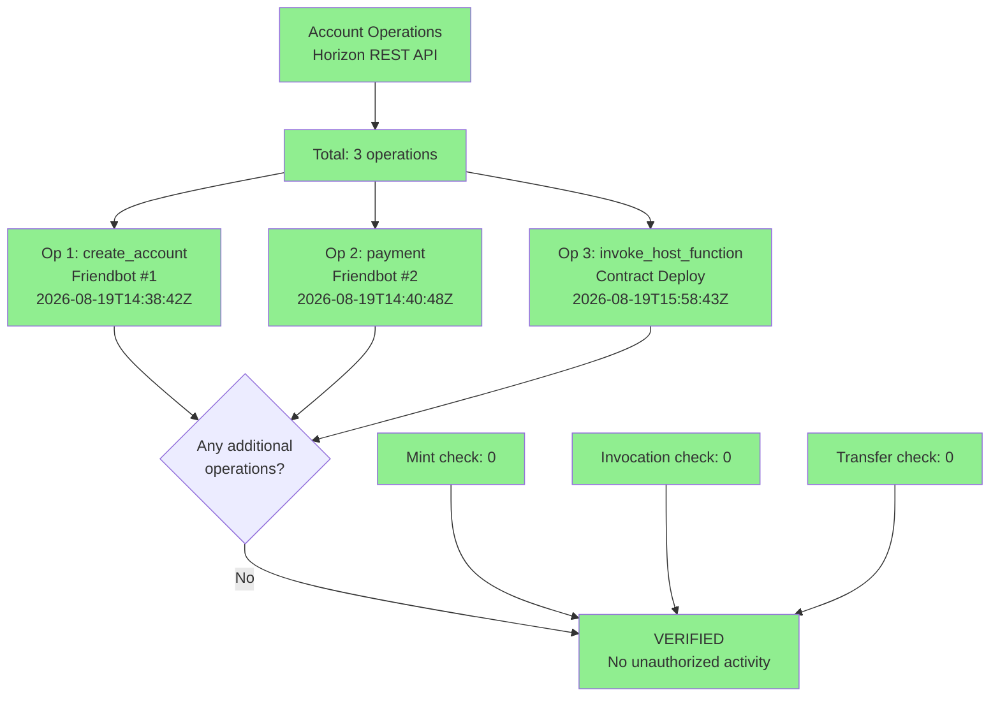

# Unauthorized Activity Verification Flow

**Date:** 2026-08-19

```mermaid
graph TD
    ACCT["Account Operations<br/>Horizon REST API"] --> COUNT["Total: 3 operations"]
    COUNT --> OP1["Op 1: create_account<br/>Friendbot #1<br/>2026-08-19T14:38:42Z"]
    COUNT --> OP2["Op 2: payment<br/>Friendbot #2<br/>2026-08-19T14:40:48Z"]
    COUNT --> OP3["Op 3: invoke_host_function<br/>Contract Deploy<br/>2026-08-19T15:58:43Z"]

    OP1 --> CHECK{"Any additional<br/>operations?"}
    OP2 --> CHECK
    OP3 --> CHECK
    CHECK -->|"No"| CLEAN["VERIFIED<br/>No unauthorized activity"]

    MINT_CHECK["Mint check: 0"] --> CLEAN
    INVOKE_CHECK["Invocation check: 0"] --> CLEAN
    TRANSFER_CHECK["Transfer check: 0"] --> CLEAN

    style ACCT fill:#90EE90
    style COUNT fill:#90EE90
    style OP1 fill:#90EE90
    style OP2 fill:#90EE90
    style OP3 fill:#90EE90
    style CLEAN fill:#90EE90
    style MINT_CHECK fill:#90EE90
    style INVOKE_CHECK fill:#90EE90
    style TRANSFER_CHECK fill:#90EE90
```
