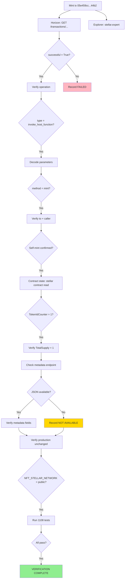

# Post-Mint Verification Flow

**Date:** 2026-08-19

```mermaid
flowchart TD
    A[Mint tx 05e459cc...44b2] --> B[Horizon: GET /transactions/...]
    A --> C[Explorer: stellar.expert]
    B --> D{successful = True?}
    D -->|Yes| E[Verify operation]
    D -->|No| FAIL[Record FAILED]
    E --> F{type = invoke_host_function?}
    F -->|Yes| G[Decode parameters]
    G --> H{method = mint?}
    H -->|Yes| I[Verify to + caller]
    I --> J{Self-mint confirmed?}
    J -->|Yes| K[Contract state: stellar contract read]
    K --> L{TokenIdCounter = 1?}
    L -->|Yes| M[Verify TotalSupply = 1]
    M --> N[Check metadata endpoint]
    N --> O{JSON available?}
    O -->|Yes| P[Verify metadata fields]
    O -->|No| Q[Record NOT AVAILABLE]
    P --> R[Verify production unchanged]
    Q --> R
    R --> S{NFT_STELLAR_NETWORK = public?}
    S -->|Yes| T[Run 1108 tests]
    T --> U{All pass?}
    U -->|Yes| V[VERIFICATION COMPLETE]

    style V fill:#90EE90
    style FAIL fill:#FFB6C1
    style Q fill:#FFD700
```
