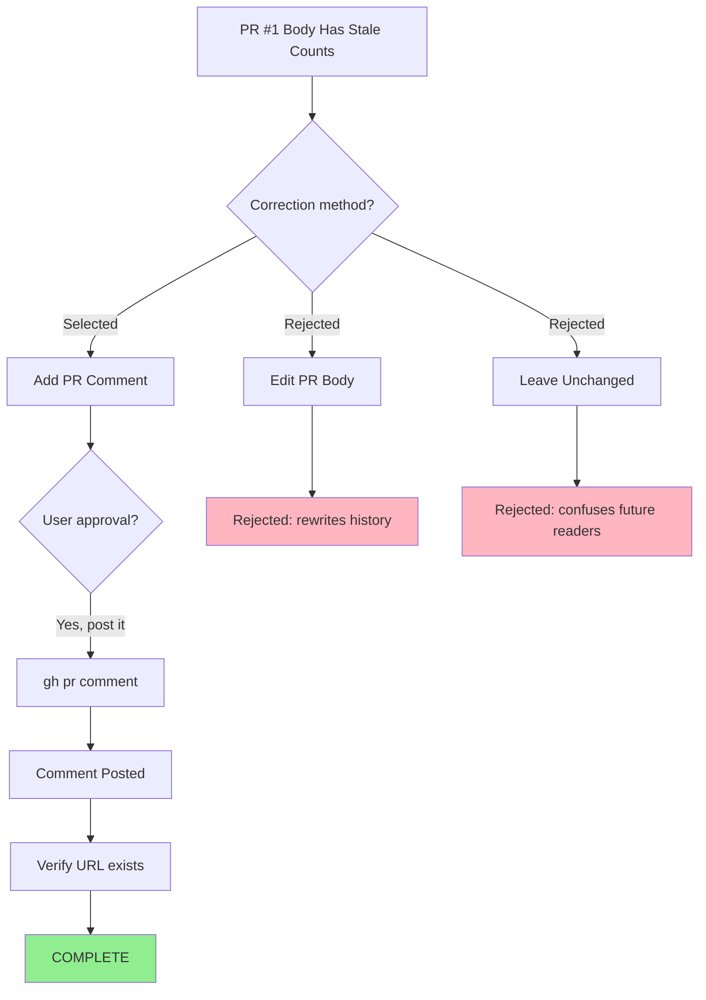

# PR Correction Flow

**Date:** 2026-08-19
**Status:** COMPLETE

```mermaid
flowchart TD
    A[PR #1 Body Has Stale Counts] --> B{Correction method?}
    B -->|Selected| C[Add PR Comment]
    B -->|Rejected| D[Edit PR Body]
    B -->|Rejected| E[Leave Unchanged]

    C --> F{User approval?}
    F -->|"Yes, post it"| G[gh pr comment]
    G --> H[Comment Posted]
    H --> I[Verify URL exists]
    I --> J[COMPLETE]

    D --> X1[Rejected: rewrites history]
    E --> X2[Rejected: confuses future readers]

    style J fill:#90EE90
    style X1 fill:#FFB6C1
    style X2 fill:#FFB6C1
```

Evidence: Comment URL https://github.com/SM-Web-Systems/lms-crypto-production/pull/1#issuecomment-5340413211
