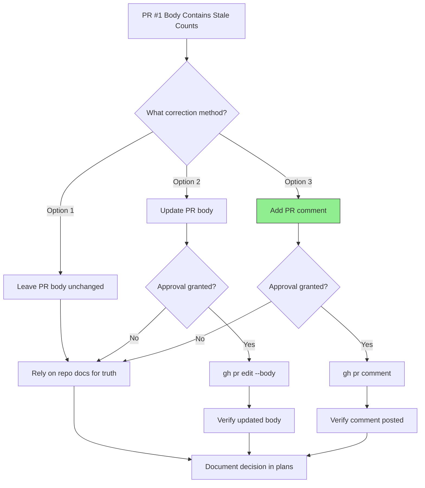

# PR Historical Record Flow

**Date:** 2026-08-19
**Status:** READY FOR DECISION

## Mermaid

## Stale Values

| Field | PR Body | Actual |
|-------|---------|--------|
| Mint tests | 24/24 | 67/67 |
| Backend (main) | 1091/1091 | 1108/1108 |
