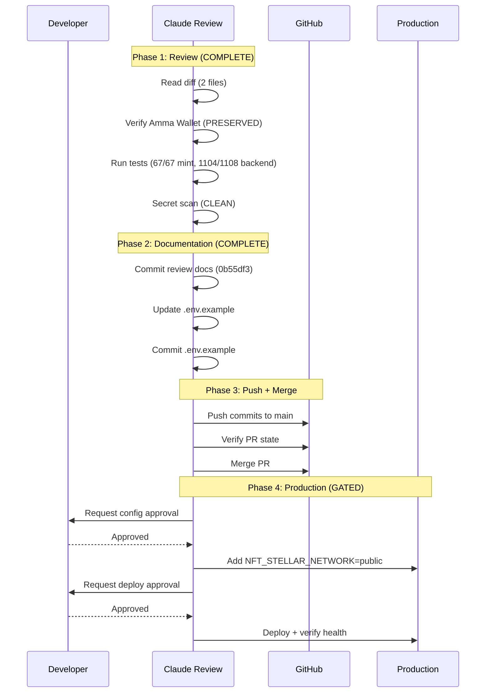

# PR Review and Merge Flow

```mermaid
sequenceDiagram
    participant Dev as Developer
    participant Claude as Claude Review
    participant GH as GitHub
    participant Prod as Production

    Note over Claude: Phase 1: Review (COMPLETE)
    Claude->>Claude: Read diff (2 files)
    Claude->>Claude: Verify Amma Wallet (PRESERVED)
    Claude->>Claude: Run tests (67/67 mint, 1104/1108 backend)
    Claude->>Claude: Secret scan (CLEAN)

    Note over Claude: Phase 2: Documentation (COMPLETE)
    Claude->>Claude: Commit review docs (0b55df3)
    Claude->>Claude: Update .env.example
    Claude->>Claude: Commit .env.example

    Note over Claude,GH: Phase 3: Push + Merge
    Claude->>GH: Push commits to main
    Claude->>GH: Verify PR state
    Claude->>GH: Merge PR #1

    Note over Claude,Prod: Phase 4: Production (GATED)
    Claude->>Dev: Request config approval
    Dev-->>Claude: Approved
    Claude->>Prod: Add NFT_STELLAR_NETWORK=public
    Claude->>Dev: Request deploy approval
    Dev-->>Claude: Approved
    Claude->>Prod: Deploy + verify health
```
