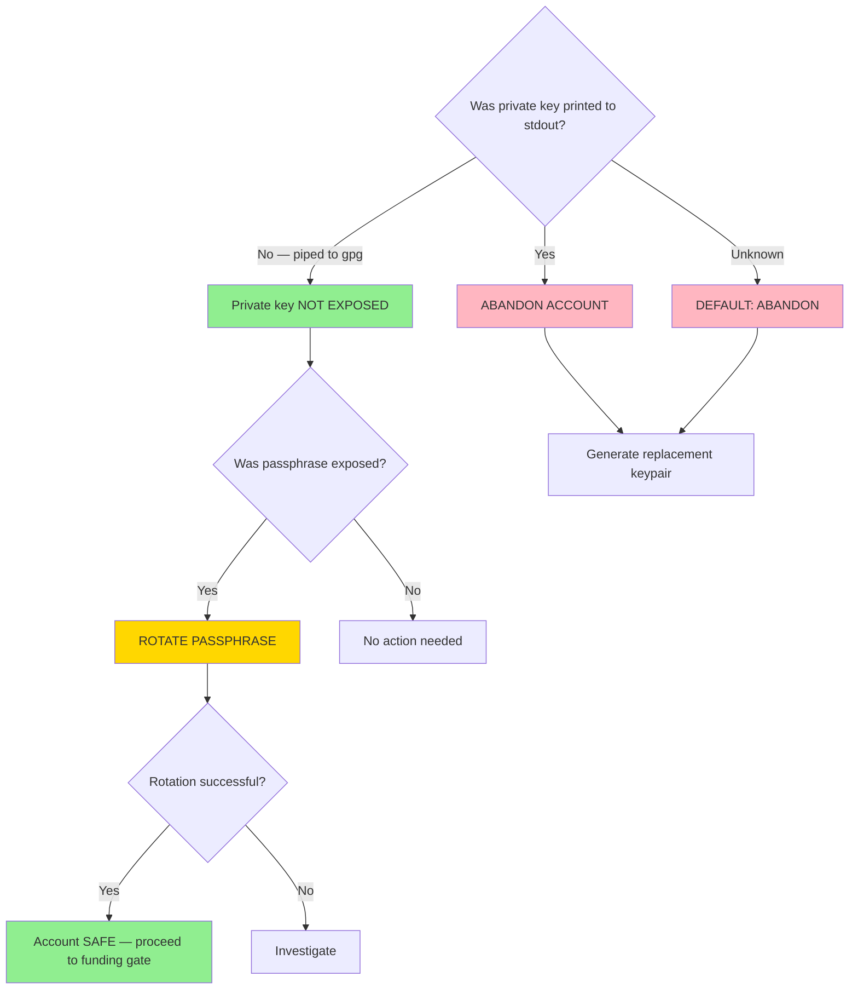

# Private Key Exposure Decision

**Date:** 2026-08-19
**Purpose:** Document the rotate-vs-abandon decision logic for this incident
and as a reference for future incidents.

## Decision for This Incident

| Question | Answer | Evidence |
|----------|--------|----------|
| Private key printed to stdout? | No | Key was piped via `stellar keys generate ... | gpg --symmetric` — never assigned to a variable or echoed |
| Private key in shell history? | No | Piped command; private key value was not part of the command string |
| Passphrase exposed? | Yes | Appeared in session output |
| Account funded? | No | Friendbot has not been called |
| Decision | ROTATE PASSPHRASE | Both conditions met: key safe, passphrase compromised |

## Default Posture

When in doubt, **ABANDON** is always the safer choice. Abandoning an unfunded,
unused account costs nothing. Retaining a compromised account costs trust.

The rotate path was chosen here only because there is clear evidence the private
key was never printed — it was piped directly to GPG stdin in a single pipeline
step with no intermediate storage.

## Funding Gate

Node **I** ("Account SAFE — proceed to funding gate") does NOT mean funding is
automatic. It means the rotation gate is cleared and the funding approval gate
(SIR-012) may now be requested. Explicit user approval is still required before
Friendbot is called.
