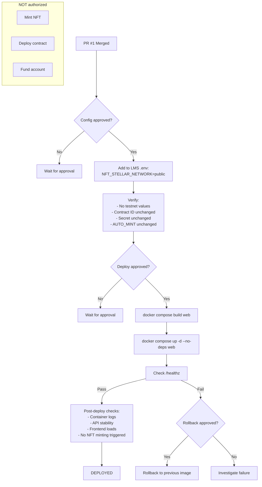

# Production Configuration and Deployment Flow

```mermaid
flowchart TD
    Merged["PR #1 Merged"] --> ConfigGate{"Config approved?"}
    ConfigGate -->|No| WaitConfig["Wait for approval"]
    ConfigGate -->|Yes| AddEnv["Add to LMS .env:<br/>NFT_STELLAR_NETWORK=public"]

    AddEnv --> VerifyEnv["Verify:<br/>- No testnet values<br/>- Contract ID unchanged<br/>- Secret unchanged<br/>- AUTO_MINT unchanged"]
    VerifyEnv --> DeployGate{"Deploy approved?"}

    DeployGate -->|No| WaitDeploy["Wait for approval"]
    DeployGate -->|Yes| Build["docker compose build web"]
    Build --> Up["docker compose up -d --no-deps web"]
    Up --> Health["Check /healthz"]

    Health -->|Pass| PostCheck["Post-deploy checks:<br/>- Container logs<br/>- API stability<br/>- Frontend loads<br/>- No NFT minting triggered"]
    Health -->|Fail| RollbackGate{"Rollback approved?"}

    RollbackGate -->|Yes| Rollback["Rollback to previous image"]
    RollbackGate -->|No| Investigate["Investigate failure"]

    PostCheck --> Done["DEPLOYED"]

    subgraph "NOT authorized"
        NoMint["Mint NFT"]
        NoContract["Deploy contract"]
        NoFund["Fund account"]
    end
```
