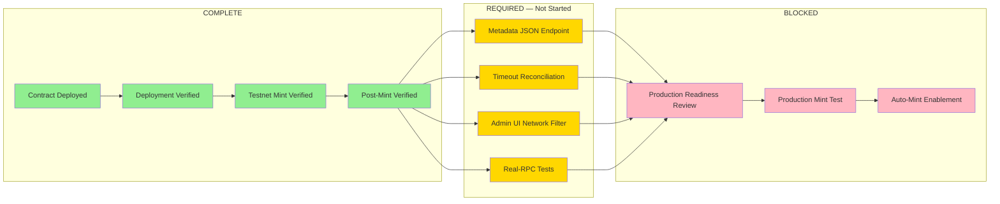

# Production Readiness Gates

**Date:** 2026-08-19

```mermaid
graph LR
    subgraph "COMPLETE"
        D[Contract Deployed]
        V[Deployment Verified]
        M[Testnet Mint Verified]
        PM[Post-Mint Verified]
    end

    subgraph "REQUIRED — Not Started"
        META[Metadata JSON Endpoint]
        RECON[Timeout Reconciliation]
        FILTER[Admin UI Network Filter]
        RPC[Real-RPC Tests]
    end

    subgraph "BLOCKED"
        REVIEW[Production Readiness Review]
        PROD_MINT[Production Mint Test]
        AUTO[Auto-Mint Enablement]
    end

    D --> V --> M --> PM
    PM --> META
    PM --> RECON
    PM --> FILTER
    PM --> RPC
    META --> REVIEW
    RECON --> REVIEW
    FILTER --> REVIEW
    RPC --> REVIEW
    REVIEW --> PROD_MINT
    PROD_MINT --> AUTO

    style D fill:#90EE90
    style V fill:#90EE90
    style M fill:#90EE90
    style PM fill:#90EE90
    style META fill:#FFD700
    style RECON fill:#FFD700
    style FILTER fill:#FFD700
    style RPC fill:#FFD700
    style REVIEW fill:#FFB6C1
    style PROD_MINT fill:#FFB6C1
    style AUTO fill:#FFB6C1
```
