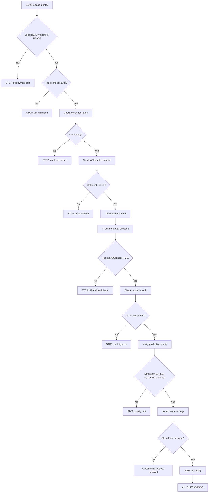
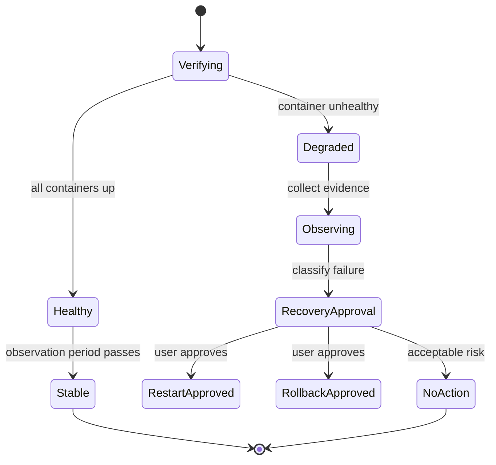
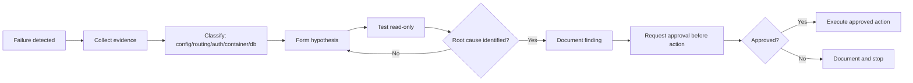
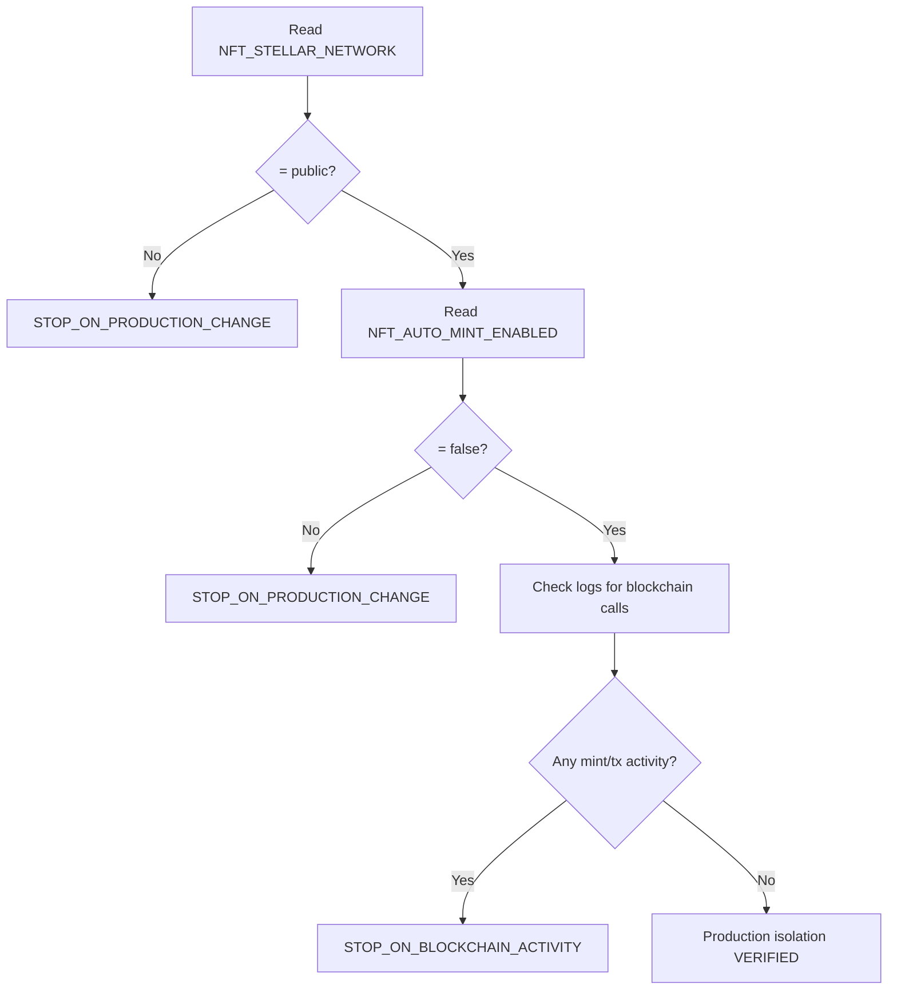

# Production Smoke Verification Flow

## Main verification flow

## Container health state machine

## Failure observation and approval flow

## Network isolation check

> Automated Mermaid parser: NOT AVAILABLE
> Manual review: COMPLETED — all diagrams use valid Mermaid syntax
