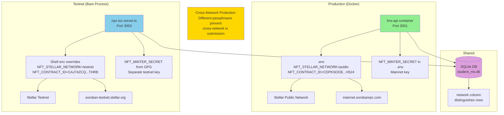

# Production–Testnet Isolation

**Date:** 2026-08-19

```mermaid
graph TB
    subgraph "Production (Docker)"
        P_DOCKER[lms-api container<br/>Port 3001]
        P_ENV[.env<br/>NFT_STELLAR_NETWORK=public<br/>NFT_CONTRACT_ID=CDPKSOOE...H524]
        P_SECRET[NFT_MINTER_SECRET in .env<br/>Mainnet key]
        P_NET[Stellar Public Network]
        P_RPC[mainnet.sorobanrpc.com]

        P_DOCKER --> P_ENV
        P_ENV --> P_NET
        P_ENV --> P_RPC
        P_DOCKER --> P_SECRET
    end

    subgraph "Testnet (Bare Process)"
        T_PROC[npx tsx server.ts<br/>Port 3003]
        T_ENV[Shell env overrides<br/>NFT_STELLAR_NETWORK=testnet<br/>NFT_CONTRACT_ID=CAJ74ZCQ...THRB]
        T_SECRET[NFT_MINTER_SECRET from GPG<br/>Separate testnet key]
        T_NET[Stellar Testnet]
        T_RPC[soroban-testnet.stellar.org]

        T_PROC --> T_ENV
        T_ENV --> T_NET
        T_ENV --> T_RPC
        T_PROC --> T_SECRET
    end

    subgraph "Shared"
        DB[(SQLite DB<br/>student_ms.db)]
        DB_NOTE[network column<br/>distinguishes rows]
    end

    P_DOCKER --> DB
    T_PROC --> DB
    DB --> DB_NOTE

    CROSS[Cross-Network Protection:<br/>Different passphrases prevent<br/>cross-network tx submission]

    style P_DOCKER fill:#90EE90
    style T_PROC fill:#87CEEB
    style CROSS fill:#FFD700
    style DB fill:#DDA0DD
```
