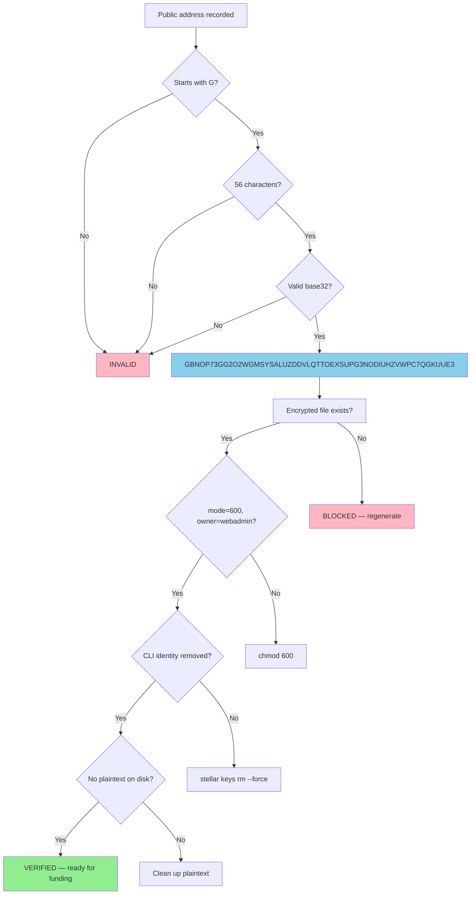

# Public Address Verification Flow

**Date:** 2026-08-19
**Status:** COMPLETE

```mermaid
flowchart TD
    A["Public address recorded"] --> B{Starts with G?}
    B -->|Yes| C{56 characters?}
    B -->|No| D["INVALID"]
    C -->|Yes| E{Valid base32?}
    C -->|No| D
    E -->|Yes| F["GBNOP73GG2O2WGMSYSALUZDDVLQTTOEXSUPG3NODIUHZVWPC7QGKUUE3"]
    E -->|No| D
    F --> G["Encrypted file exists?"]
    G -->|Yes| H{mode=600, owner=webadmin?}
    G -->|No| I["BLOCKED — regenerate"]
    H -->|Yes| J{CLI identity removed?}
    H -->|No| K["chmod 600"]
    J -->|Yes| L{No plaintext on disk?}
    J -->|No| M["stellar keys rm --force"]
    L -->|Yes| N["VERIFIED — ready for funding"]
    L -->|No| O["Clean up plaintext"]

    style N fill:#90EE90
    style D fill:#FFB6C1
    style I fill:#FFB6C1
    style F fill:#87CEEB
```
