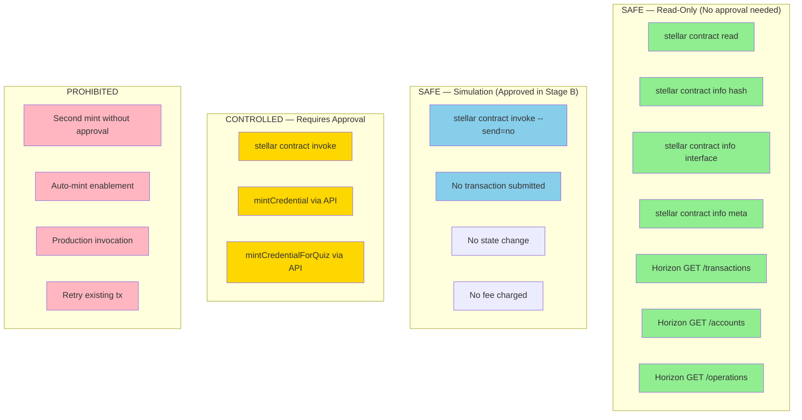

# Real-RPC Test Boundary

**Date:** 2026-08-19

```mermaid
graph TB
    subgraph "SAFE — Read-Only (No approval needed)"
        R1[stellar contract read]
        R2[stellar contract info hash]
        R3[stellar contract info interface]
        R4[stellar contract info meta]
        R5[Horizon GET /transactions]
        R6[Horizon GET /accounts]
        R7[Horizon GET /operations]
    end

    subgraph "SAFE — Simulation (Approved in Stage B)"
        S1[stellar contract invoke --send=no]
        S2[No transaction submitted]
        S3[No state change]
        S4[No fee charged]
    end

    subgraph "CONTROLLED — Requires Approval"
        C1[stellar contract invoke]
        C2[mintCredential via API]
        C3[mintCredentialForQuiz via API]
    end

    subgraph "PROHIBITED"
        P1[Second mint without approval]
        P2[Auto-mint enablement]
        P3[Production invocation]
        P4[Retry existing tx]
    end

    style R1 fill:#90EE90
    style R2 fill:#90EE90
    style R3 fill:#90EE90
    style R4 fill:#90EE90
    style R5 fill:#90EE90
    style R6 fill:#90EE90
    style R7 fill:#90EE90
    style S1 fill:#87CEEB
    style S2 fill:#87CEEB
    style C1 fill:#FFD700
    style C2 fill:#FFD700
    style C3 fill:#FFD700
    style P1 fill:#FFB6C1
    style P2 fill:#FFB6C1
    style P3 fill:#FFB6C1
    style P4 fill:#FFB6C1
```
