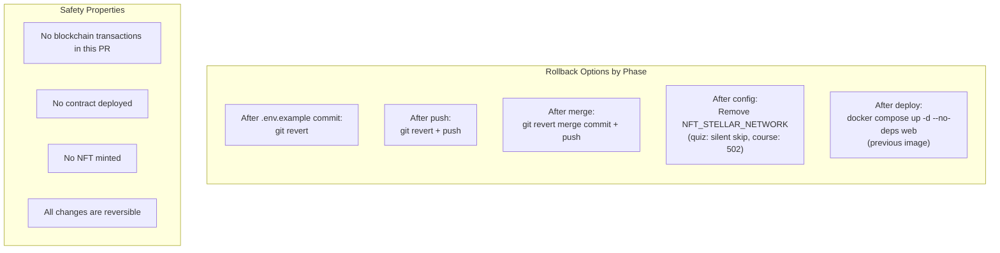

# Release Rollback Flow

```mermaid
flowchart TD
    subgraph "Rollback Options by Phase"
        direction TB

        R1["After .env.example commit:<br/>git revert"]
        R2["After push:<br/>git revert + push"]
        R3["After merge:<br/>git revert merge commit + push"]
        R4["After config:<br/>Remove NFT_STELLAR_NETWORK<br/>(quiz: silent skip, course: 502)"]
        R5["After deploy:<br/>docker compose up -d --no-deps web<br/>(previous image)"]
    end

    subgraph "Safety Properties"
        S1["No blockchain transactions in this PR"]
        S2["No contract deployed"]
        S3["No NFT minted"]
        S4["All changes are reversible"]
    end
```
