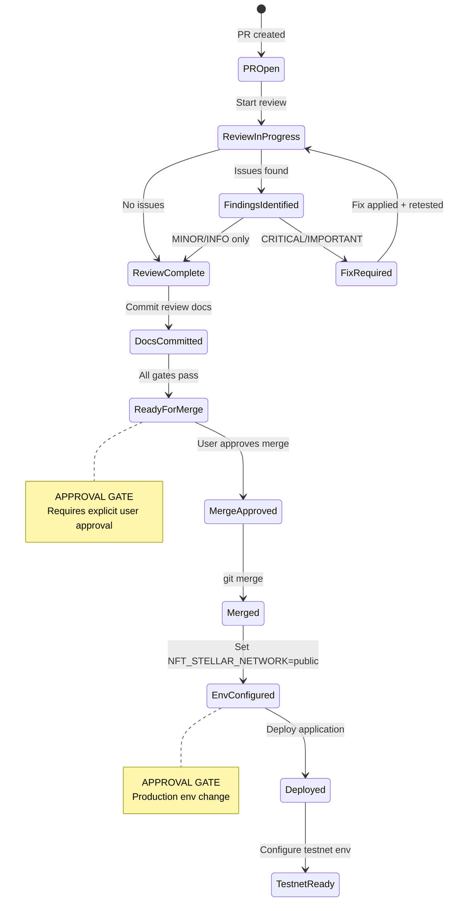

# Review and Release State Machine

```mermaid
stateDiagram-v2
    [*] --> PROpen: PR created
    PROpen --> ReviewInProgress: Start review
    ReviewInProgress --> FindingsIdentified: Issues found
    ReviewInProgress --> ReviewComplete: No issues

    FindingsIdentified --> FixRequired: CRITICAL/IMPORTANT
    FindingsIdentified --> ReviewComplete: MINOR/INFO only
    FixRequired --> ReviewInProgress: Fix applied + retested

    ReviewComplete --> DocsCommitted: Commit review docs
    DocsCommitted --> ReadyForMerge: All gates pass

    ReadyForMerge --> MergeApproved: User approves merge
    MergeApproved --> Merged: git merge

    Merged --> EnvConfigured: Set NFT_STELLAR_NETWORK=public
    EnvConfigured --> Deployed: Deploy application
    Deployed --> TestnetReady: Configure testnet env

    note right of ReadyForMerge
        APPROVAL GATE
        Requires explicit user approval
    end note

    note right of EnvConfigured
        APPROVAL GATE
        Production env change
    end note
```
