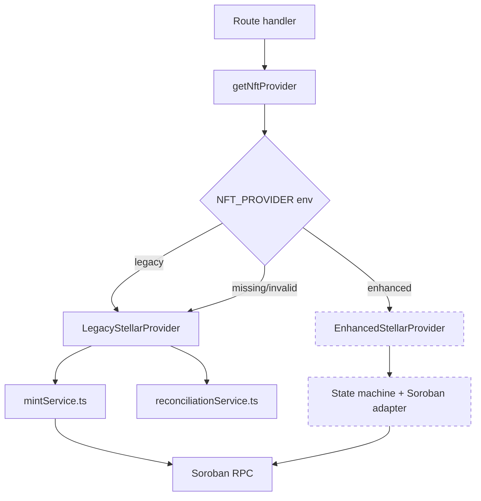
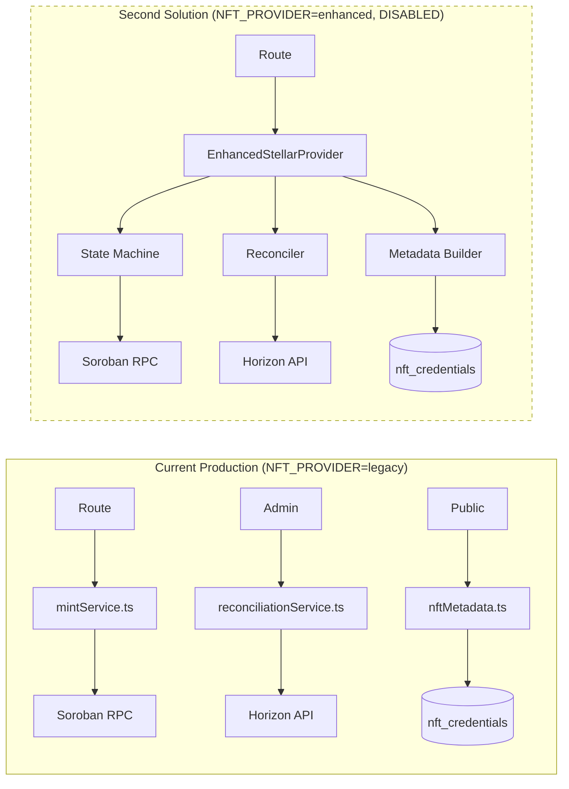
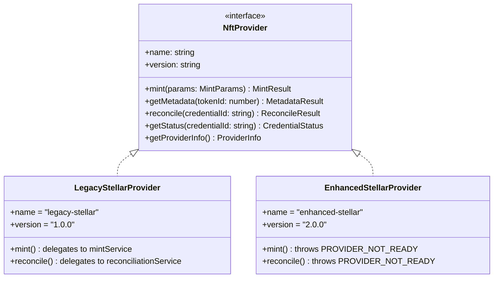
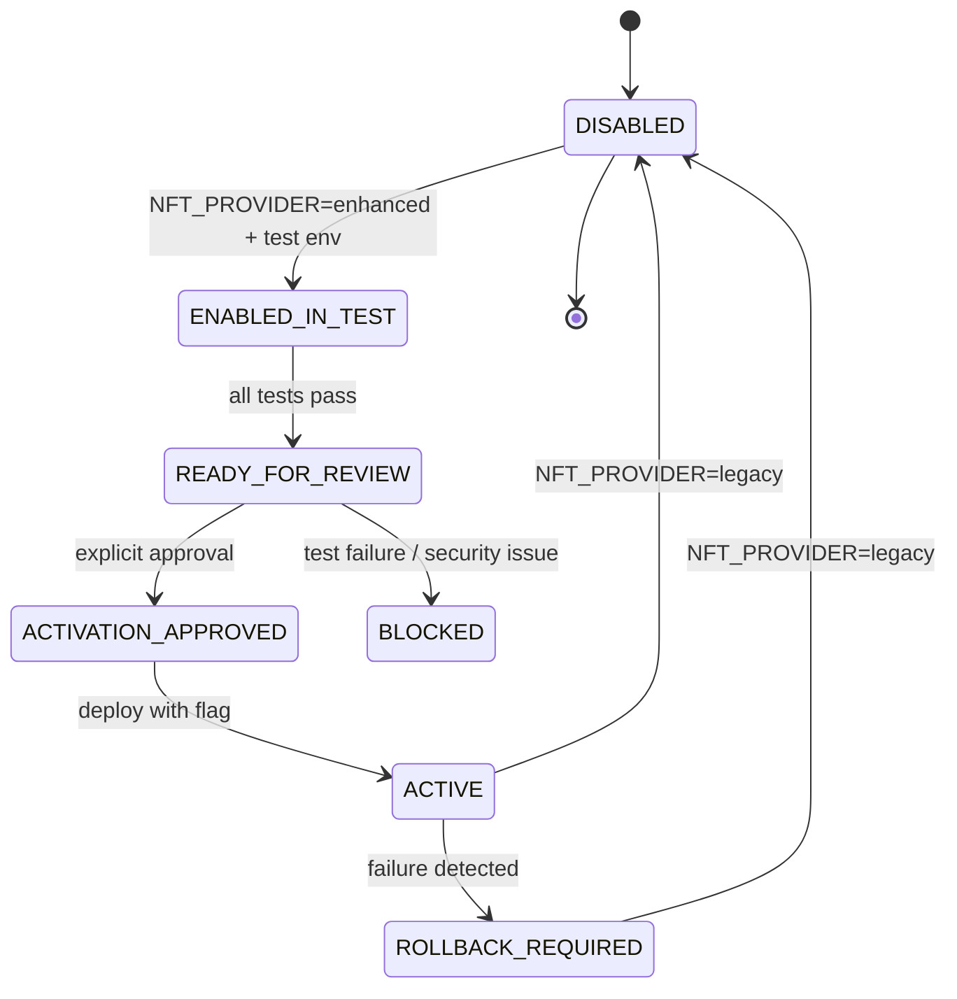
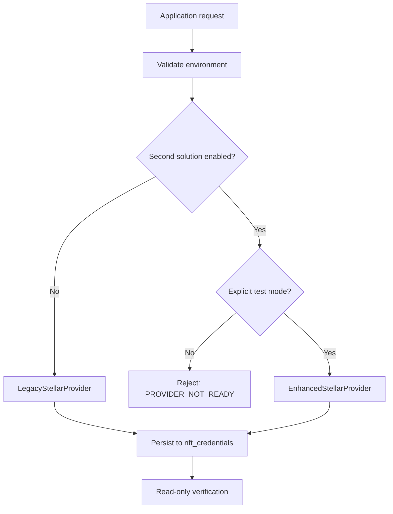
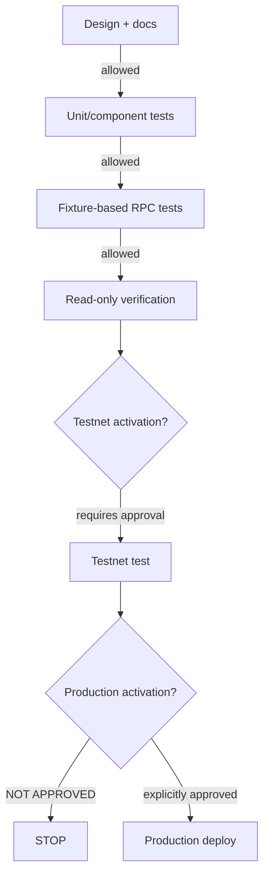

# Second NFT Solution — Diagrams

## Provider Selection Flow

## Existing vs Second Solution

## Provider Interface Contract

## Feature Flag State Machine

## Credential Boundary

## Approval Gates

> Automated Mermaid parser: NOT AVAILABLE
> Manual review: COMPLETED — all diagrams use valid Mermaid syntax
