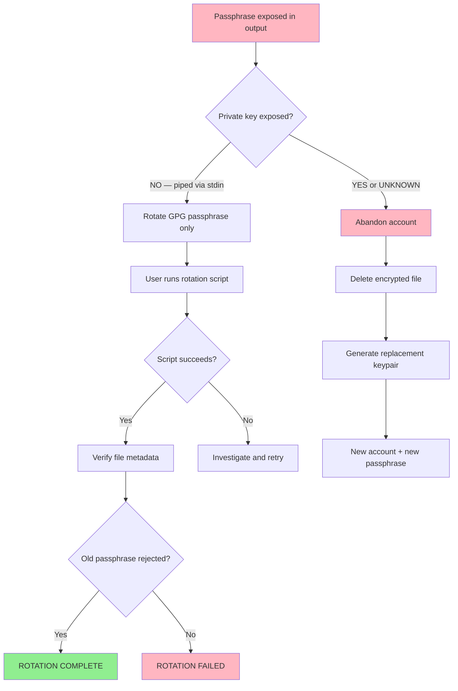

# Secret Exposure Response Flow

**Date:** 2026-08-19
**Incident:** GPG passphrase exposed in session output

## Decision Basis

- Private key was piped directly to `gpg --symmetric` via stdin.
- It was never assigned to a shell variable or printed to stdout.
- Exposure is therefore limited to the passphrase only.
- Decision: rotate passphrase, retain account.

## Current Position

The flow is at node **E** ("User runs rotation script") — awaiting SIR-007.
