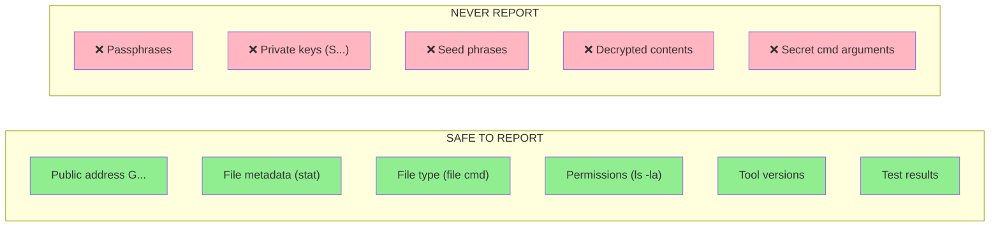

# Secret Reporting Boundary

**Date:** 2026-08-19
**Purpose:** Define what Claude Code may and may not include in any response,
log, file, commit message, or tool output — at all times, not only during incidents.

## Boundary Rules

### Always safe

| Item | Example | Notes |
|------|---------|-------|
| Public Stellar address | `GBNOP73GG2O2WGMSYSALUZDDVLQTTOEXSUPG3NODIUHZVWPC7QGKUUE3` | G... prefix — public by design |
| File metadata | `mode=600 owner=webadmin` | Non-secret stat output |
| File type | `PGP symmetric AES-256 encrypted data` | Non-secret file classification |
| Permissions | `-rw-------` | Non-secret filesystem metadata |
| Tool versions | `gpg (GnuPG) 2.4.4` | Non-secret software metadata |
| Test results | `1108/1108 tests passed` | Non-secret CI output |
| Script exit codes | `Exit code: 0` | Non-secret process result |
| Error messages (non-secret) | `BAD_PASSPHRASE` (without the passphrase) | Confirm failure without revealing value |

### Never report

| Item | Example pattern | Why forbidden |
|------|----------------|---------------|
| Passphrase | Any string used to protect a GPG file | Direct credential exposure |
| Private key | `S...` (56-char Stellar secret seed) | Full account compromise |
| Seed phrase | 12/24 word mnemonic | Full wallet compromise |
| Decrypted file contents | Output of `gpg --decrypt` | Contains private key |
| Secret as CLI argument | `gpg --passphrase <value>` | Appears in `ps`, shell history |
| JWT secret | `SESSION_SECRET=...` value | Auth bypass risk |
| Database password | `MYSQL_PASSWORD=...` value | DB compromise risk |
| SMTP password | `SMTP_PASS=...` value | Mail relay abuse risk |

## Enforcement

This boundary applies:
- In all chat responses
- In all files written by the Write tool
- In all Edit tool changes
- In all git commit messages
- In all bash command outputs that Claude Code chooses to display
- In all documentation, plans, diagrams, and test matrices

If a tool output unexpectedly contains a secret value, Claude Code must:
1. Not quote or reproduce the secret in its response
2. Note that a secret appeared in output (without reproducing it)
3. Follow the exposure response flow (`2026-08-19-secret-exposure-response-flow.md`)
