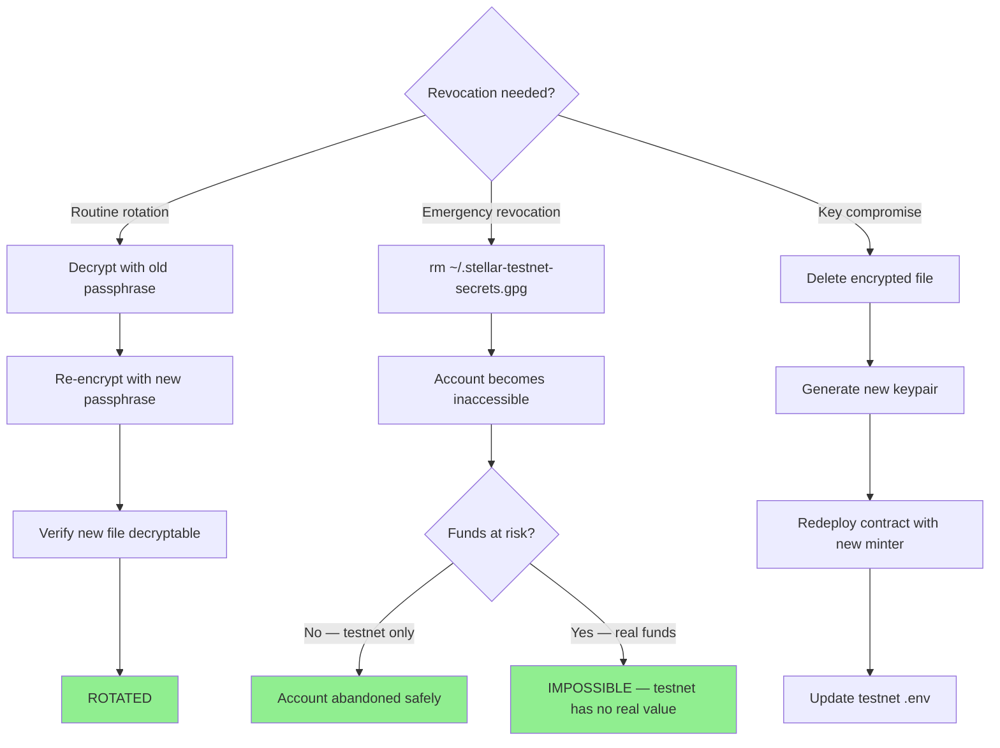

# Secret Revocation Flow

**Date:** 2026-08-19
**Status:** DESIGN COMPLETE

```mermaid
flowchart TD
    A{Revocation needed?} -->|Routine rotation| B[Decrypt with old passphrase]
    B --> C[Re-encrypt with new passphrase]
    C --> D[Verify new file decryptable]
    D --> E[ROTATED]

    A -->|Emergency revocation| F["rm ~/.stellar-testnet-secrets.gpg"]
    F --> G[Account becomes inaccessible]
    G --> H{Funds at risk?}
    H -->|No — testnet only| I[Account abandoned safely]
    H -->|Yes — real funds| J[IMPOSSIBLE — testnet has no real value]

    A -->|Key compromise| K[Delete encrypted file]
    K --> L[Generate new keypair]
    L --> M[Redeploy contract with new minter]
    M --> N[Update testnet .env]

    style E fill:#90EE90
    style I fill:#90EE90
    style J fill:#90EE90
```
