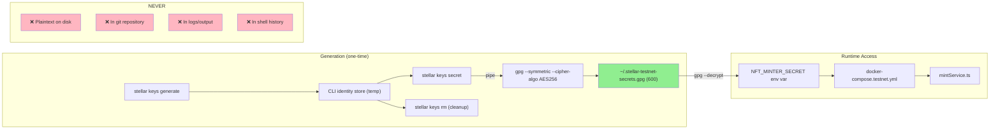

# Secret Storage Flow

**Date:** 2026-08-19
**Status:** DESIGN COMPLETE

```mermaid
flowchart LR
    subgraph "Generation (one-time)"
        GEN["stellar keys generate"] --> CLI_STORE["CLI identity store (temp)"]
        CLI_STORE --> SECRET["stellar keys secret"]
        SECRET -->|pipe| GPG["gpg --symmetric --cipher-algo AES256"]
        GPG --> ENCRYPTED["~/.stellar-testnet-secrets.gpg (600)"]
        CLI_STORE --> RM["stellar keys rm (cleanup)"]
    end

    subgraph "Runtime Access"
        ENCRYPTED -->|"gpg --decrypt"| ENV["NFT_MINTER_SECRET env var"]
        ENV --> DOCKER["docker-compose.testnet.yml"]
        DOCKER --> MINT["mintService.ts"]
    end

    subgraph "NEVER"
        PLAINTEXT["❌ Plaintext on disk"]
        GIT["❌ In git repository"]
        LOGS["❌ In logs/output"]
        HISTORY["❌ In shell history"]
    end

    style ENCRYPTED fill:#90EE90
    style PLAINTEXT fill:#FFB6C1
    style GIT fill:#FFB6C1
    style LOGS fill:#FFB6C1
    style HISTORY fill:#FFB6C1
```
