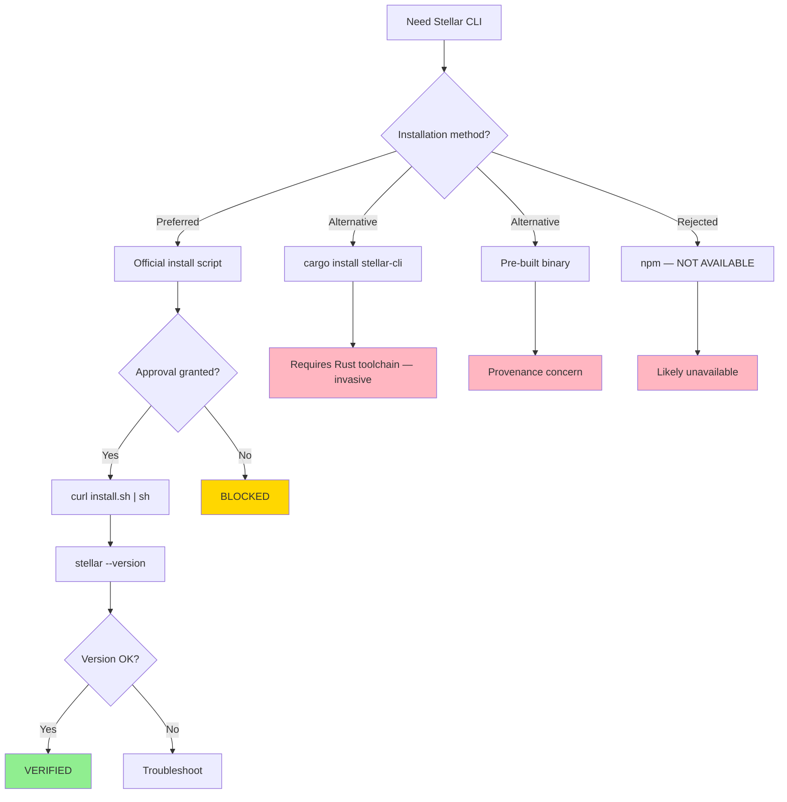

# Stellar CLI Installation Flow

**Date:** 2026-08-19
**Status:** BLOCKED — Requires approval

```mermaid
flowchart TD
    A[Need Stellar CLI] --> B{Installation method?}
    B -->|Preferred| C[Official install script]
    B -->|Alternative| D[cargo install stellar-cli]
    B -->|Alternative| E[Pre-built binary]
    B -->|Rejected| F[npm — NOT AVAILABLE]

    C --> G{Approval granted?}
    G -->|Yes| H["curl install.sh | sh"]
    G -->|No| I[BLOCKED]
    H --> J[stellar --version]
    J --> K{Version OK?}
    K -->|Yes| L[VERIFIED]
    K -->|No| M[Troubleshoot]

    D --> N[Requires Rust toolchain — invasive]
    E --> O[Provenance concern]
    F --> P[Likely unavailable]

    style I fill:#FFD700
    style L fill:#90EE90
    style N fill:#FFB6C1
    style O fill:#FFB6C1
    style P fill:#FFB6C1
```
