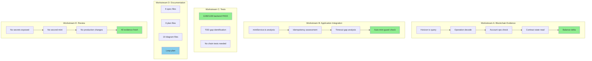

# Subagent Review Map

**Date:** 2026-08-19

```mermaid
graph TB
    subgraph "Workstream A: Blockchain Evidence"
        A1[Horizon tx query]
        A2[Operation decode]
        A3[Account ops check]
        A4[Contract state read]
        A5[Balance delta]
    end

    subgraph "Workstream B: Application Integration"
        B1[mintService.ts analysis]
        B2[Idempotency assessment]
        B3[Timeout gap analysis]
        B4[Auto-mint guard check]
    end

    subgraph "Workstream C: Tests"
        C1[1108/1108 backend PASS]
        C2[TDD gap identification]
        C3[No chain tests needed]
    end

    subgraph "Workstream D: Documentation"
        D1[6 spec files]
        D2[6 plan files]
        D3[10 diagram files]
        D4[Loop plan]
    end

    subgraph "Workstream E: Review"
        E1[No secrets exposed]
        E2[No second mint]
        E3[No production changes]
        E4[All evidence fresh]
    end

    A1 --> A2 --> A3 --> A4 --> A5
    B1 --> B2 --> B3 --> B4
    E1 --> E2 --> E3 --> E4

    style A5 fill:#90EE90
    style B4 fill:#90EE90
    style C1 fill:#90EE90
    style D4 fill:#87CEEB
    style E4 fill:#90EE90
```
