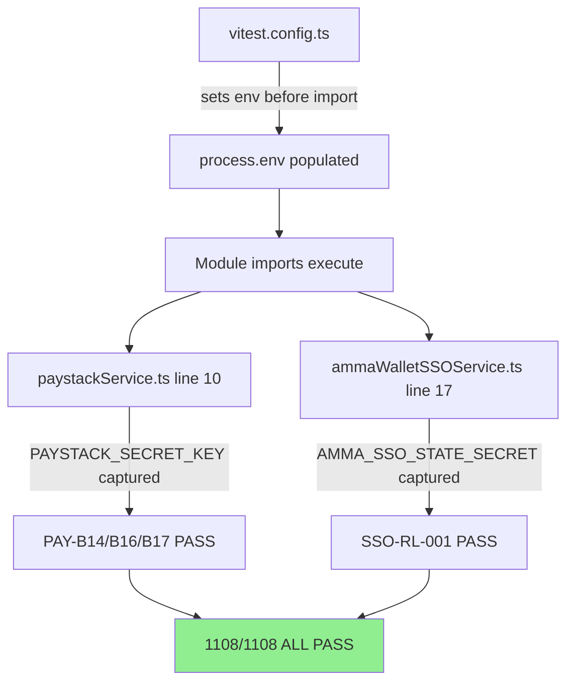

# Test Environment Verification Flow

**Date:** 2026-08-19
**Status:** VERIFIED

## Mermaid

## Root Cause
Module-level `process.env` capture reads env vars at import time, before test setup blocks run.

## Fix
Added 2 env vars to vitest.config.ts `test.env` block (commit 94a7d4d). Follows existing JWT_SECRET pattern.
