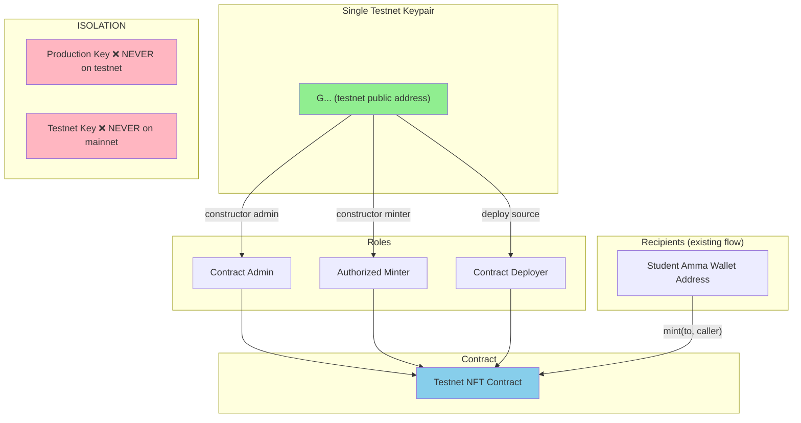

# Testnet Account Roles

**Date:** 2026-08-19
**Status:** DESIGN COMPLETE

```mermaid
graph TB
    subgraph "Single Testnet Keypair"
        KEY["G... (testnet public address)"]
    end

    subgraph "Roles"
        KEY -->|"constructor admin"| ADMIN["Contract Admin"]
        KEY -->|"constructor minter"| MINTER["Authorized Minter"]
        KEY -->|"deploy source"| DEPLOYER["Contract Deployer"]
    end

    subgraph "Contract"
        ADMIN --> CONTRACT["Testnet NFT Contract"]
        MINTER --> CONTRACT
        DEPLOYER --> CONTRACT
    end

    subgraph "Recipients (existing flow)"
        STUDENT["Student Amma Wallet Address"] -->|"mint(to, caller)"| CONTRACT
    end

    subgraph "ISOLATION"
        PROD_KEY["Production Key ❌ NEVER on testnet"]
        TEST_KEY["Testnet Key ❌ NEVER on mainnet"]
    end

    style KEY fill:#90EE90
    style PROD_KEY fill:#FFB6C1
    style TEST_KEY fill:#FFB6C1
    style CONTRACT fill:#87CEEB
```
