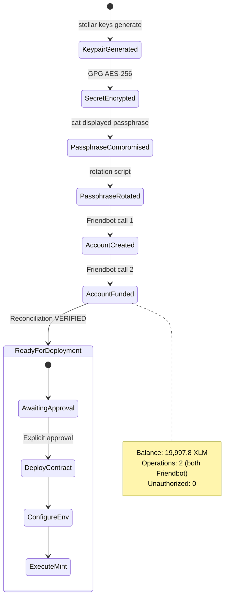

# Testnet Account State Flow

**Date:** 2026-08-19

```mermaid
stateDiagram-v2
    [*] --> KeypairGenerated: stellar keys generate
    KeypairGenerated --> SecretEncrypted: GPG AES-256
    SecretEncrypted --> PassphraseCompromised: cat displayed passphrase
    PassphraseCompromised --> PassphraseRotated: rotation script
    PassphraseRotated --> AccountCreated: Friendbot call 1
    AccountCreated --> AccountFunded: Friendbot call 2
    AccountFunded --> ReadyForDeployment: Reconciliation VERIFIED

    state ReadyForDeployment {
        [*] --> AwaitingApproval
        AwaitingApproval --> DeployContract: Explicit approval
        DeployContract --> ConfigureEnv
        ConfigureEnv --> ExecuteMint
    }

    note right of AccountFunded
        Balance: 19,997.8 XLM
        Operations: 2 (both Friendbot)
        Unauthorized: 0
    end note
```
