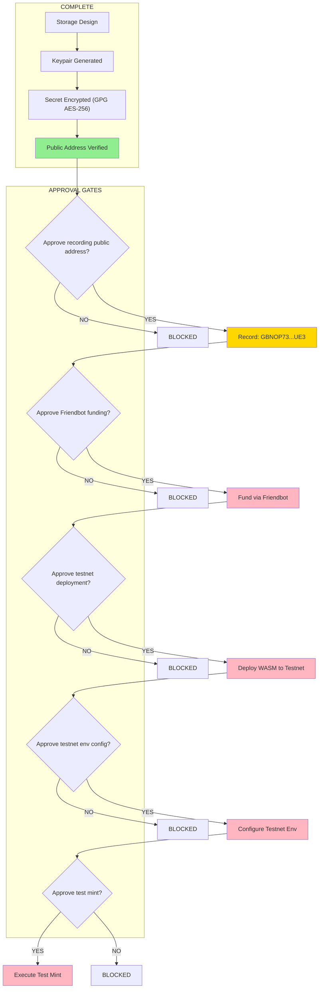

# Testnet Approval Gates

**Date:** 2026-08-19
**Updated:** Phase 9 (Post-Keypair Generation)

```mermaid
flowchart TD
    subgraph "COMPLETE"
        S1["Storage Design"] --> S2["Keypair Generated"]
        S2 --> S3["Secret Encrypted (GPG AES-256)"]
        S3 --> S4["Public Address Verified"]
    end

    subgraph "APPROVAL GATES"
        G1{Approve recording public address?}
        G2{Approve Friendbot funding?}
        G3{Approve testnet deployment?}
        G4{Approve testnet env config?}
        G5{Approve test mint?}
    end

    S4 --> G1
    G1 -->|YES| REC["Record: GBNOP73...UE3"]
    G1 -->|NO| B1[BLOCKED]
    REC --> G2
    G2 -->|YES| FUND["Fund via Friendbot"]
    G2 -->|NO| B2[BLOCKED]
    FUND --> G3
    G3 -->|YES| DEPLOY["Deploy WASM to Testnet"]
    G3 -->|NO| B3[BLOCKED]
    DEPLOY --> G4
    G4 -->|YES| ENV["Configure Testnet Env"]
    G4 -->|NO| B4[BLOCKED]
    ENV --> G5
    G5 -->|YES| MINT["Execute Test Mint"]
    G5 -->|NO| B5[BLOCKED]

    style S4 fill:#90EE90
    style REC fill:#FFD700
    style FUND fill:#FFB6C1
    style DEPLOY fill:#FFB6C1
    style ENV fill:#FFB6C1
    style MINT fill:#FFB6C1
```
