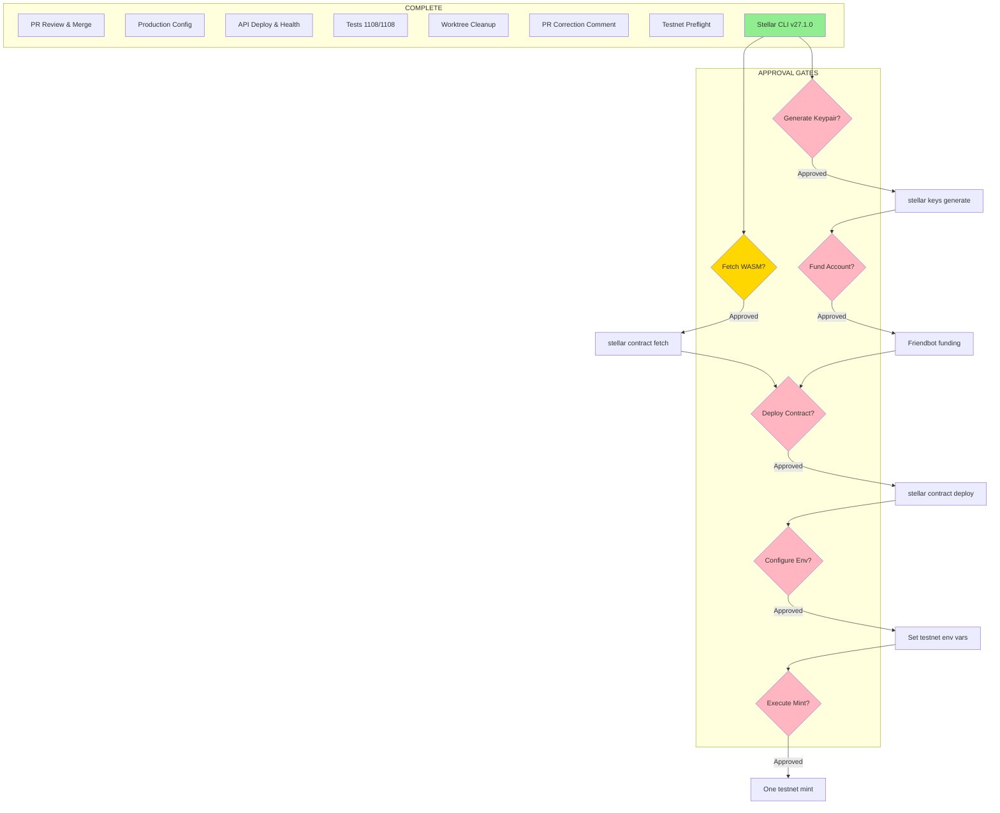

# Testnet Approval Gates

**Date:** 2026-08-19
**Updated:** Post-CLI Installation

```mermaid
flowchart TD
    subgraph "COMPLETE"
        C1["PR Review & Merge"]
        C2["Production Config"]
        C3["API Deploy & Health"]
        C4["Tests 1108/1108"]
        C5["Worktree Cleanup"]
        C6["PR Correction Comment"]
        C7["Testnet Preflight"]
        C8["Stellar CLI v27.1.0"]
    end

    subgraph "APPROVAL GATES"
        G1{"Fetch WASM?"}
        G2{"Generate Keypair?"}
        G3{"Fund Account?"}
        G4{"Deploy Contract?"}
        G5{"Configure Env?"}
        G6{"Execute Mint?"}
    end

    C8 --> G1
    C8 --> G2
    G1 -->|Approved| T1["stellar contract fetch"]
    G2 -->|Approved| T2["stellar keys generate"]
    T2 --> G3
    G3 -->|Approved| T3["Friendbot funding"]
    T1 --> G4
    T3 --> G4
    G4 -->|Approved| T4["stellar contract deploy"]
    T4 --> G5
    G5 -->|Approved| T5["Set testnet env vars"]
    T5 --> G6
    G6 -->|Approved| T6["One testnet mint"]

    style C8 fill:#90EE90
    style G1 fill:#FFD700
    style G2 fill:#FFB6C1
    style G3 fill:#FFB6C1
    style G4 fill:#FFB6C1
    style G5 fill:#FFB6C1
    style G6 fill:#FFB6C1
```
