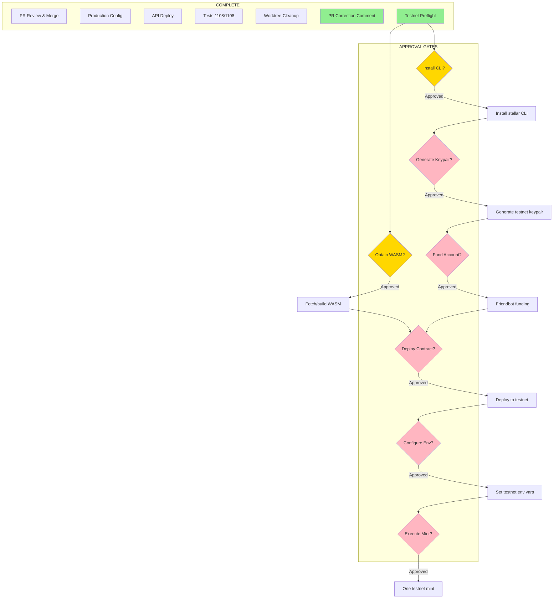

# Testnet Approval Gates

**Date:** 2026-08-19

```mermaid
flowchart TD
    subgraph "COMPLETE"
        C1[PR Review & Merge]
        C2[Production Config]
        C3[API Deploy]
        C4[Tests 1108/1108]
        C5[Worktree Cleanup]
        C6[PR Correction Comment]
        C7[Testnet Preflight]
    end

    subgraph "APPROVAL GATES"
        G1{"Install CLI?"}
        G2{"Obtain WASM?"}
        G3{"Generate Keypair?"}
        G4{"Fund Account?"}
        G5{"Deploy Contract?"}
        G6{"Configure Env?"}
        G7{"Execute Mint?"}
    end

    C7 --> G1
    C7 --> G2
    G1 -->|Approved| T1[Install stellar CLI]
    G2 -->|Approved| T2[Fetch/build WASM]
    T1 --> G3
    G3 -->|Approved| T3[Generate testnet keypair]
    T3 --> G4
    G4 -->|Approved| T4[Friendbot funding]
    T2 --> G5
    T4 --> G5
    G5 -->|Approved| T5[Deploy to testnet]
    T5 --> G6
    G6 -->|Approved| T6[Set testnet env vars]
    T6 --> G7
    G7 -->|Approved| T7[One testnet mint]

    style C6 fill:#90EE90
    style C7 fill:#90EE90
    style G1 fill:#FFD700
    style G2 fill:#FFD700
    style G3 fill:#FFB6C1
    style G4 fill:#FFB6C1
    style G5 fill:#FFB6C1
    style G6 fill:#FFB6C1
    style G7 fill:#FFB6C1
```
