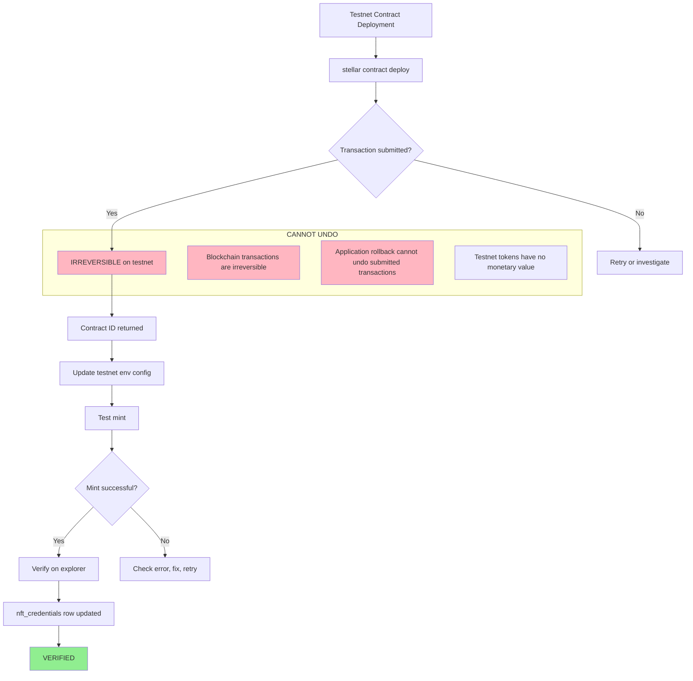

# Testnet Deployment and Rollback Flow

**Date:** 2026-08-19
**Status:** BLOCKED

```mermaid
flowchart TD
    A[Testnet Contract Deployment] --> B[stellar contract deploy]
    B --> C{Transaction submitted?}
    C -->|Yes| D[IRREVERSIBLE on testnet]
    C -->|No| E[Retry or investigate]

    D --> F[Contract ID returned]
    F --> G[Update testnet env config]
    G --> H[Test mint]
    H --> I{Mint successful?}
    I -->|Yes| J[Verify on explorer]
    I -->|No| K[Check error, fix, retry]

    J --> L[nft_credentials row updated]
    L --> M[VERIFIED]

    subgraph "CANNOT UNDO"
        D
        N["Blockchain transactions are irreversible"]
        O["Application rollback cannot undo submitted transactions"]
        P["Testnet tokens have no monetary value"]
    end

    style D fill:#FFB6C1
    style M fill:#90EE90
    style N fill:#FFB6C1
    style O fill:#FFB6C1
```
