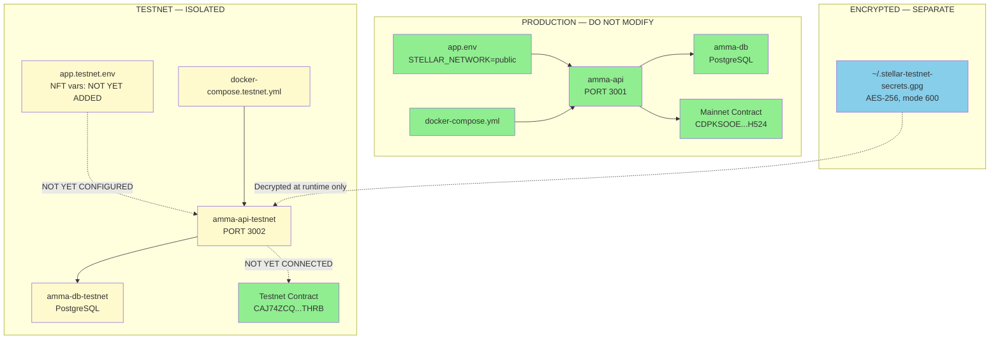

# Testnet Environment Isolation

**Date:** 2026-08-19

```mermaid
graph TB
    subgraph "PRODUCTION — DO NOT MODIFY"
        PROD_ENV["app.env<br/>STELLAR_NETWORK=public"]
        PROD_COMPOSE["docker-compose.yml"]
        PROD_API["amma-api<br/>PORT 3001"]
        PROD_DB["amma-db<br/>PostgreSQL"]
        PROD_CONTRACT["Mainnet Contract<br/>CDPKSOOE...H524"]
    end

    subgraph "TESTNET — ISOLATED"
        TEST_ENV["app.testnet.env<br/>NFT vars: NOT YET ADDED"]
        TEST_COMPOSE["docker-compose.testnet.yml"]
        TEST_API["amma-api-testnet<br/>PORT 3002"]
        TEST_DB["amma-db-testnet<br/>PostgreSQL"]
        TEST_CONTRACT["Testnet Contract<br/>CAJ74ZCQ...THRB"]
    end

    subgraph "ENCRYPTED — SEPARATE"
        GPG["~/.stellar-testnet-secrets.gpg<br/>AES-256, mode 600"]
    end

    PROD_ENV --> PROD_API
    PROD_COMPOSE --> PROD_API
    PROD_API --> PROD_DB
    PROD_API --> PROD_CONTRACT

    TEST_ENV -.->|"NOT YET CONFIGURED"| TEST_API
    TEST_COMPOSE --> TEST_API
    TEST_API --> TEST_DB
    TEST_API -.->|"NOT YET CONNECTED"| TEST_CONTRACT

    GPG -.->|"Decrypted at runtime only"| TEST_API

    style PROD_ENV fill:#90EE90
    style PROD_COMPOSE fill:#90EE90
    style PROD_API fill:#90EE90
    style PROD_DB fill:#90EE90
    style PROD_CONTRACT fill:#90EE90
    style TEST_ENV fill:#FFFACD
    style TEST_COMPOSE fill:#FFFACD
    style TEST_API fill:#FFFACD
    style TEST_DB fill:#FFFACD
    style TEST_CONTRACT fill:#90EE90
    style GPG fill:#87CEEB
```
