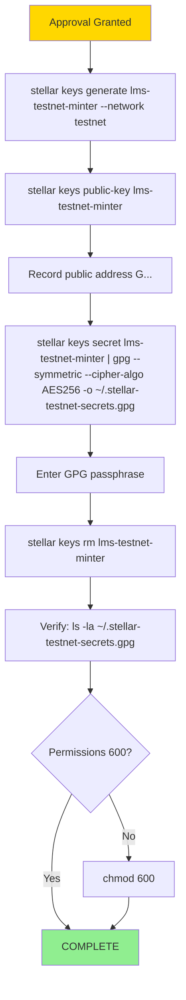

# Testnet Keypair Generation Flow

**Date:** 2026-08-19
**Status:** BLOCKED — Requires approval

```mermaid
flowchart TD
    A[Approval Granted] --> B["stellar keys generate lms-testnet-minter --network testnet"]
    B --> C["stellar keys public-key lms-testnet-minter"]
    C --> D[Record public address G...]
    D --> E["stellar keys secret lms-testnet-minter | gpg --symmetric --cipher-algo AES256 -o ~/.stellar-testnet-secrets.gpg"]
    E --> F[Enter GPG passphrase]
    F --> G["stellar keys rm lms-testnet-minter"]
    G --> H[Verify: ls -la ~/.stellar-testnet-secrets.gpg]
    H --> I{Permissions 600?}
    I -->|Yes| J[COMPLETE]
    I -->|No| K[chmod 600]
    K --> J

    style A fill:#FFD700
    style J fill:#90EE90
```
