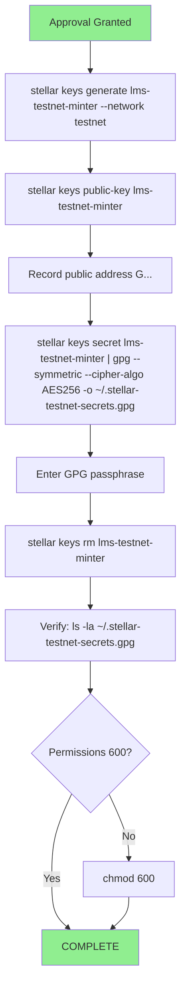

# Testnet Keypair Generation Flow

**Date:** 2026-08-19
**Status:** COMPLETE

> **Public Address:** `GBNOP73GG2O2WGMSYSALUZDDVLQTTOEXSUPG3NODIUHZVWPC7QGKUUE3`
> **Encrypted file:** `~/.stellar-testnet-secrets.gpg` (mode 600, AES-256)
> **Account:** NOT funded

