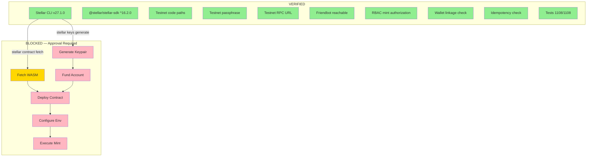

# Testnet Readiness Flow

**Date:** 2026-08-19
**Updated:** Post-CLI Installation

```mermaid
flowchart TD
    subgraph "VERIFIED"
        V1["Stellar CLI v27.1.0"]
        V2["@stellar/stellar-sdk ^16.2.0"]
        V3["Testnet code paths"]
        V4["Testnet passphrase"]
        V5["Testnet RPC URL"]
        V6["Friendbot reachable"]
        V7["RBAC mint authorization"]
        V8["Wallet linkage check"]
        V9["Idempotency check"]
        V10["Tests 1108/1108"]
    end

    subgraph "BLOCKED — Approval Required"
        B1["Fetch WASM"]
        B2["Generate Keypair"]
        B3["Fund Account"]
        B4["Deploy Contract"]
        B5["Configure Env"]
        B6["Execute Mint"]
    end

    V1 -->|"stellar contract fetch"| B1
    V1 -->|"stellar keys generate"| B2
    B1 --> B4
    B2 --> B3
    B3 --> B4
    B4 --> B5
    B5 --> B6

    style V1 fill:#90EE90
    style V2 fill:#90EE90
    style V3 fill:#90EE90
    style V4 fill:#90EE90
    style V5 fill:#90EE90
    style V6 fill:#90EE90
    style V7 fill:#90EE90
    style V8 fill:#90EE90
    style V9 fill:#90EE90
    style V10 fill:#90EE90
    style B1 fill:#FFD700
    style B2 fill:#FFB6C1
    style B3 fill:#FFB6C1
    style B4 fill:#FFB6C1
    style B5 fill:#FFB6C1
    style B6 fill:#FFB6C1
```
