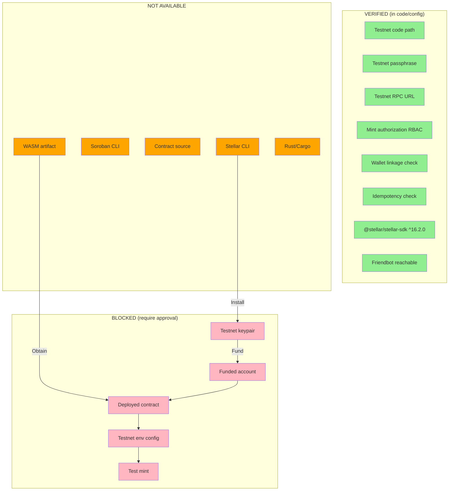

# Testnet Tooling Preflight Flow

**Date:** 2026-08-19
**Status:** COMPLETE (Read-Only)

```mermaid
flowchart TD
    subgraph "VERIFIED (in code/config)"
        V1[Testnet code path]
        V2[Testnet passphrase]
        V3[Testnet RPC URL]
        V4[Mint authorization RBAC]
        V5[Wallet linkage check]
        V6[Idempotency check]
        V7["@stellar/stellar-sdk ^16.2.0"]
        V8[Friendbot reachable]
    end

    subgraph "NOT AVAILABLE"
        N1[Stellar CLI]
        N2[Soroban CLI]
        N3[Contract source]
        N4[WASM artifact]
        N5[Rust/Cargo]
    end

    subgraph "BLOCKED (require approval)"
        B1[Testnet keypair]
        B2[Funded account]
        B3[Deployed contract]
        B4[Testnet env config]
        B5[Test mint]
    end

    N1 -->|"Install"| B1
    N4 -->|"Obtain"| B3
    B1 -->|"Fund"| B2
    B2 --> B3
    B3 --> B4
    B4 --> B5

    style V1 fill:#90EE90
    style V2 fill:#90EE90
    style V3 fill:#90EE90
    style V4 fill:#90EE90
    style V5 fill:#90EE90
    style V6 fill:#90EE90
    style V7 fill:#90EE90
    style V8 fill:#90EE90
    style N1 fill:#FFA500
    style N2 fill:#FFA500
    style N3 fill:#FFA500
    style N4 fill:#FFA500
    style N5 fill:#FFA500
    style B1 fill:#FFB6C1
    style B2 fill:#FFB6C1
    style B3 fill:#FFB6C1
    style B4 fill:#FFB6C1
    style B5 fill:#FFB6C1
```
