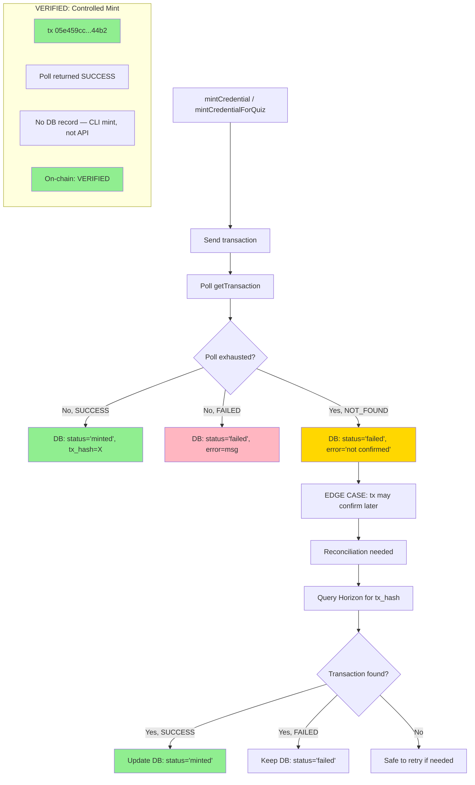

# Timeout Reconciliation Flow (Post-Mint Update)

**Date:** 2026-08-19
**Updated:** Phase 17

```mermaid
flowchart TD
    MINT[mintCredential / mintCredentialForQuiz] --> SEND[Send transaction]
    SEND --> POLL[Poll getTransaction]
    POLL --> TIMEOUT{Poll exhausted?}
    TIMEOUT -->|No, SUCCESS| DB_OK[DB: status='minted', tx_hash=X]
    TIMEOUT -->|No, FAILED| DB_FAIL[DB: status='failed', error=msg]
    TIMEOUT -->|Yes, NOT_FOUND| DB_TIMEOUT[DB: status='failed', error='not confirmed']

    DB_TIMEOUT --> EDGE[EDGE CASE: tx may confirm later]
    EDGE --> RECONCILE[Reconciliation needed]

    RECONCILE --> QUERY[Query Horizon for tx_hash]
    QUERY --> FOUND{Transaction found?}
    FOUND -->|Yes, SUCCESS| FIX[Update DB: status='minted']
    FOUND -->|Yes, FAILED| KEEP[Keep DB: status='failed']
    FOUND -->|No| SAFE[Safe to retry if needed]

    subgraph "VERIFIED: Controlled Mint"
        ACTUAL[tx 05e459cc...44b2]
        ACTUAL_STATUS[Poll returned SUCCESS]
        ACTUAL_DB[No DB record — CLI mint, not API]
        ACTUAL_CHAIN[On-chain: VERIFIED]
    end

    style DB_OK fill:#90EE90
    style DB_FAIL fill:#FFB6C1
    style DB_TIMEOUT fill:#FFD700
    style FIX fill:#90EE90
    style ACTUAL fill:#90EE90
    style ACTUAL_CHAIN fill:#90EE90
```
