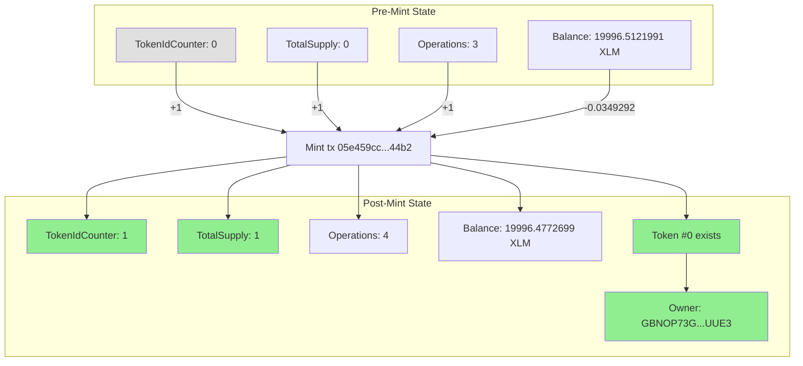

# Token State Verification

**Date:** 2026-08-19

```mermaid
graph TD
    subgraph "Pre-Mint State"
        PRE_COUNTER[TokenIdCounter: 0]
        PRE_SUPPLY[TotalSupply: 0]
        PRE_OPS[Operations: 3]
        PRE_BAL[Balance: 19996.5121991 XLM]
    end

    MINT[Mint tx 05e459cc...44b2]

    subgraph "Post-Mint State"
        POST_COUNTER[TokenIdCounter: 1]
        POST_SUPPLY[TotalSupply: 1]
        POST_OPS[Operations: 4]
        POST_BAL[Balance: 19996.4772699 XLM]
        TOKEN[Token #0 exists]
        OWNER[Owner: GBNOP73G...UUE3]
    end

    PRE_COUNTER -->|+1| MINT
    PRE_SUPPLY -->|+1| MINT
    PRE_OPS -->|+1| MINT
    PRE_BAL -->|-0.0349292| MINT
    MINT --> POST_COUNTER
    MINT --> POST_SUPPLY
    MINT --> POST_OPS
    MINT --> POST_BAL
    MINT --> TOKEN
    TOKEN --> OWNER

    style PRE_COUNTER fill:#E0E0E0
    style POST_COUNTER fill:#90EE90
    style POST_SUPPLY fill:#90EE90
    style TOKEN fill:#90EE90
    style OWNER fill:#90EE90
```
