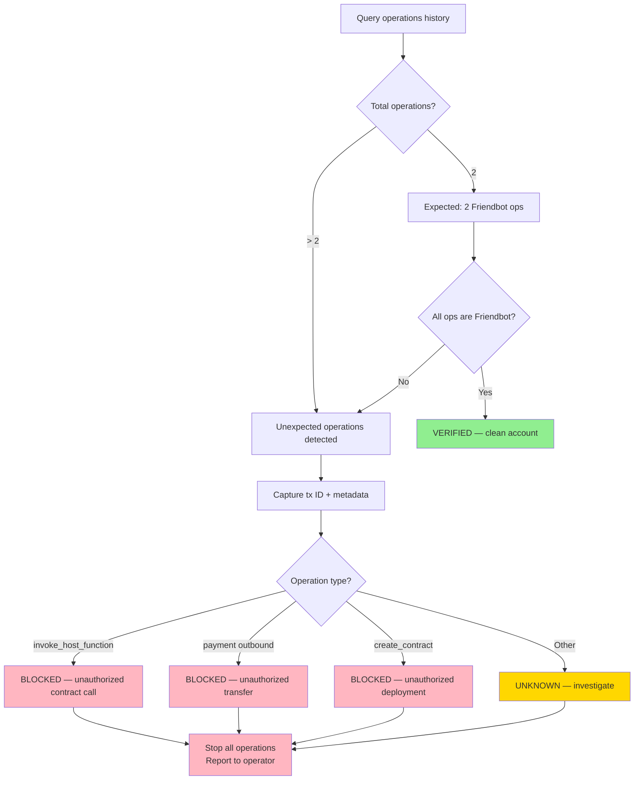

# Unexpected Transaction Decision Flow

**Date:** 2026-08-19
**Current status:** No unexpected transactions found

```mermaid
flowchart TD
    A["Query operations history"] --> B{"Total operations?"}
    B -->|2| C["Expected: 2 Friendbot ops"]
    B -->|"> 2"| D["Unexpected operations detected"]

    C --> E{"All ops are Friendbot?"}
    E -->|Yes| F["VERIFIED — clean account"]
    E -->|No| D

    D --> G["Capture tx ID + metadata"]
    G --> H{"Operation type?"}
    H -->|invoke_host_function| I["BLOCKED — unauthorized contract call"]
    H -->|payment outbound| J["BLOCKED — unauthorized transfer"]
    H -->|create_contract| K["BLOCKED — unauthorized deployment"]
    H -->|Other| L["UNKNOWN — investigate"]

    I --> M["Stop all operations\nReport to operator"]
    J --> M
    K --> M
    L --> M

    style F fill:#90EE90
    style I fill:#FFB6C1
    style J fill:#FFB6C1
    style K fill:#FFB6C1
    style L fill:#FFD700
    style M fill:#FFB6C1
```
