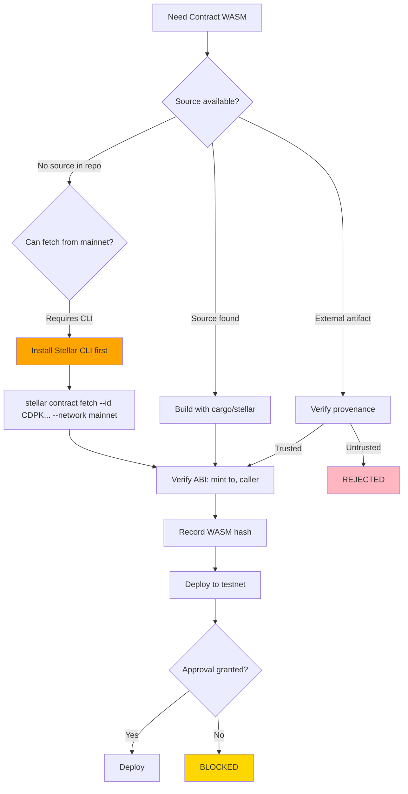

# WASM Provenance Flow

**Date:** 2026-08-19
**Status:** BLOCKED

```mermaid
flowchart TD
    A[Need Contract WASM] --> B{Source available?}
    B -->|No source in repo| C{Can fetch from mainnet?}
    C -->|Requires CLI| D[Install Stellar CLI first]
    D --> E["stellar contract fetch --id CDPK... --network mainnet"]
    E --> F[Verify ABI: mint to, caller]
    F --> G[Record WASM hash]
    G --> H[Deploy to testnet]

    B -->|Source found| I[Build with cargo/stellar]
    I --> F

    B -->|External artifact| J[Verify provenance]
    J -->|Trusted| F
    J -->|Untrusted| K[REJECTED]

    H --> L{Approval granted?}
    L -->|Yes| M[Deploy]
    L -->|No| N[BLOCKED]

    style D fill:#FFA500
    style N fill:#FFD700
    style K fill:#FFB6C1
```
