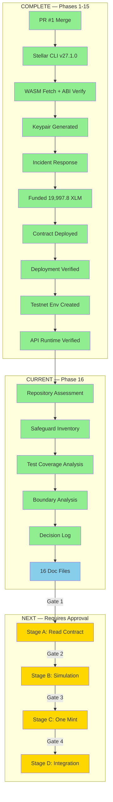

# Workstream Map

**Date:** 2026-08-19
**Updated:** Phase 16 (Assessment Complete)

```mermaid
graph TB
    subgraph "COMPLETE — Phases 1-15"
        PR[PR #1 Merge] --> CLI[Stellar CLI v27.1.0]
        CLI --> WASM[WASM Fetch + ABI Verify]
        WASM --> KEYPAIR[Keypair Generated]
        KEYPAIR --> INCIDENT[Incident Response]
        INCIDENT --> FUND[Funded 19,997.8 XLM]
        FUND --> DEPLOY[Contract Deployed]
        DEPLOY --> VERIFY[Deployment Verified]
        VERIFY --> ENV[Testnet Env Created]
        ENV --> API[API Runtime Verified]
    end

    subgraph "CURRENT — Phase 16"
        API --> ASSESS[Repository Assessment]
        ASSESS --> SAFEGUARDS[Safeguard Inventory]
        SAFEGUARDS --> COVERAGE[Test Coverage Analysis]
        COVERAGE --> BOUNDARY[Boundary Analysis]
        BOUNDARY --> DECISION[Decision Log]
        DECISION --> DOCUMENTATION[16 Doc Files]
    end

    subgraph "NEXT — Requires Approval"
        DOCUMENTATION -->|Gate 1| READ[Stage A: Read Contract]
        READ -->|Gate 2| SIM[Stage B: Simulation]
        SIM -->|Gate 3| MINT[Stage C: One Mint]
        MINT -->|Gate 4| INTEG[Stage D: Integration]
    end

    style PR fill:#90EE90
    style CLI fill:#90EE90
    style WASM fill:#90EE90
    style KEYPAIR fill:#90EE90
    style INCIDENT fill:#90EE90
    style FUND fill:#90EE90
    style DEPLOY fill:#90EE90
    style VERIFY fill:#90EE90
    style ENV fill:#90EE90
    style API fill:#90EE90
    style ASSESS fill:#90EE90
    style SAFEGUARDS fill:#90EE90
    style COVERAGE fill:#90EE90
    style BOUNDARY fill:#90EE90
    style DECISION fill:#90EE90
    style DOCUMENTATION fill:#87CEEB
    style READ fill:#FFD700
    style SIM fill:#FFD700
    style MINT fill:#FFD700
    style INTEG fill:#FFD700
```
