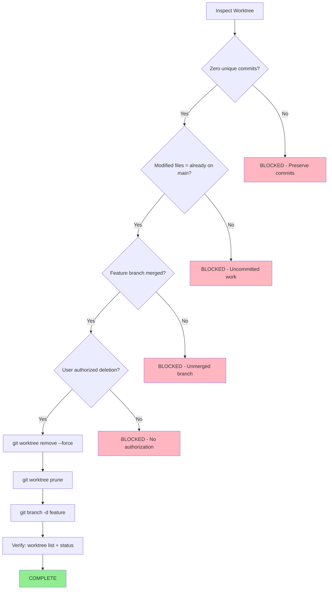

# Worktree Cleanup Flow

**Date:** 2026-08-19
**Status:** COMPLETE

## Mermaid

```mermaid
flowchart TD
    A[Inspect Worktree] --> B{Zero unique commits?}
    B -->|Yes| C{Modified files = already on main?}
    B -->|No| X[BLOCKED - Preserve commits]
    C -->|Yes| D{Feature branch merged?}
    C -->|No| X2[BLOCKED - Uncommitted work]
    D -->|Yes| E{User authorized deletion?}
    D -->|No| X3[BLOCKED - Unmerged branch]
    E -->|Yes| F[git worktree remove --force]
    E -->|No| X4[BLOCKED - No authorization]
    F --> G[git worktree prune]
    G --> H[git branch -d feature]
    H --> I[Verify: worktree list + status]
    I --> J[COMPLETE]

    style J fill:#90EE90
    style X fill:#FFB6C1
    style X2 fill:#FFB6C1
    style X3 fill:#FFB6C1
    style X4 fill:#FFB6C1
```

## Evidence

- All conditions passed → COMPLETE
- Worktree removed, branch deleted, status clean
