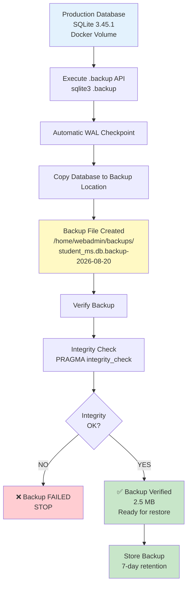
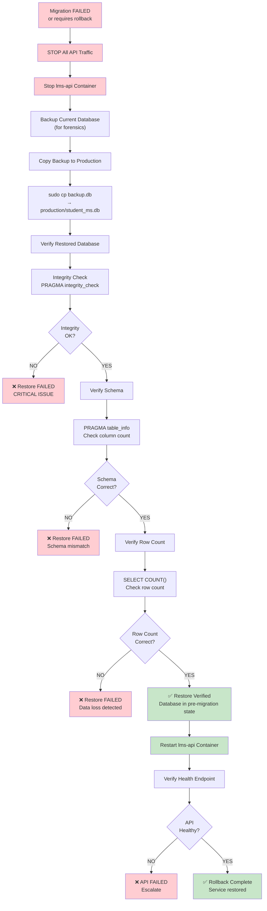
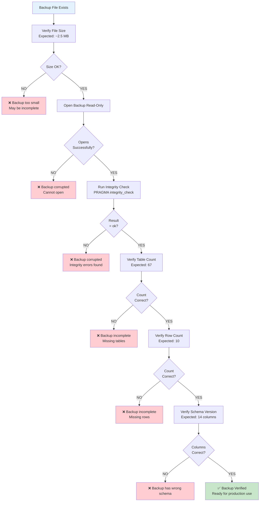
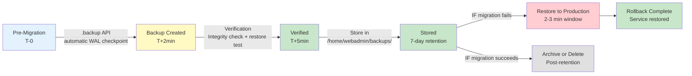
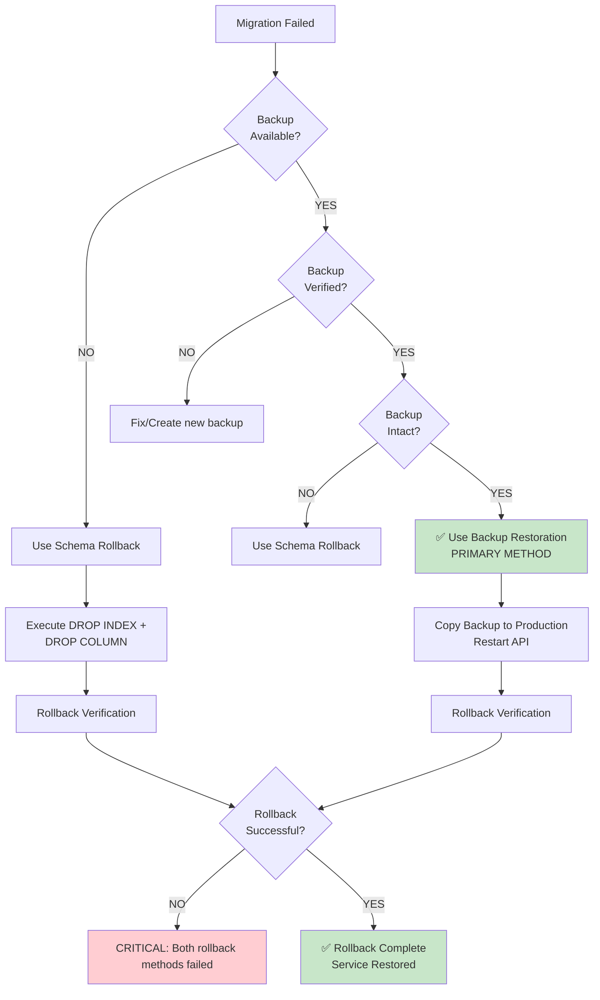

# Backup & Restore Flow Diagram
**Date:** 2026-08-20
**Document:** Flowchart showing backup creation and restoration procedures

---

## Backup Creation Flow

---

## Restore Procedure (Rollback)

---

## Backup Verification Loop

---

## Backup Lifecycle

---

## Backup vs. Schema Rollback Decision Tree

---

## References

- Backup Spec: `2026-08-20-production-database-backup-spec.md`
- Rollback Spec: `2026-08-20-production-migration-rollback-spec.md`
