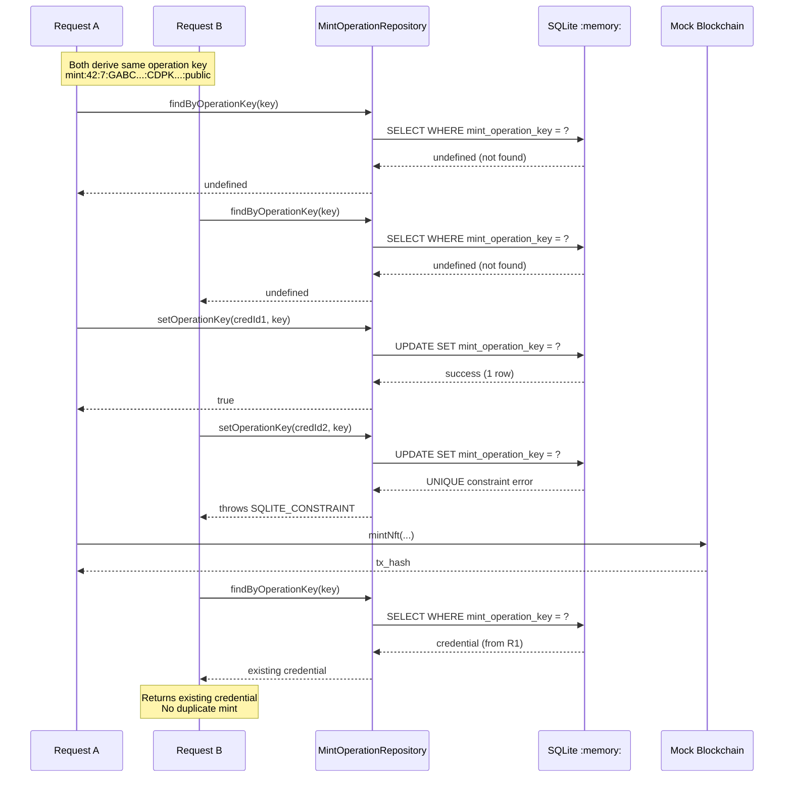

# Concurrent Request Flow

```mermaid
sequenceDiagram
    participant R1 as Request A
    participant R2 as Request B
    participant Repo as MintOperationRepository
    participant DB as SQLite :memory:
    participant BC as Mock Blockchain

    Note over R1,R2: Both derive same operation key<br/>mint:42:7:GABC...:CDPK...:public

    R1->>Repo: findByOperationKey(key)
    Repo->>DB: SELECT WHERE mint_operation_key = ?
    DB-->>Repo: undefined (not found)
    Repo-->>R1: undefined

    R2->>Repo: findByOperationKey(key)
    Repo->>DB: SELECT WHERE mint_operation_key = ?
    DB-->>Repo: undefined (not found)
    Repo-->>R2: undefined

    R1->>Repo: setOperationKey(credId1, key)
    Repo->>DB: UPDATE SET mint_operation_key = ?
    DB-->>Repo: success (1 row)
    Repo-->>R1: true

    R2->>Repo: setOperationKey(credId2, key)
    Repo->>DB: UPDATE SET mint_operation_key = ?
    DB-->>Repo: UNIQUE constraint error
    Repo-->>R2: throws SQLITE_CONSTRAINT

    R1->>BC: mintNft(...)
    BC-->>R1: tx_hash

    R2->>Repo: findByOperationKey(key)
    Repo->>DB: SELECT WHERE mint_operation_key = ?
    DB-->>Repo: credential (from R1)
    Repo-->>R2: existing credential

    Note over R2: Returns existing credential<br/>No duplicate mint
```
