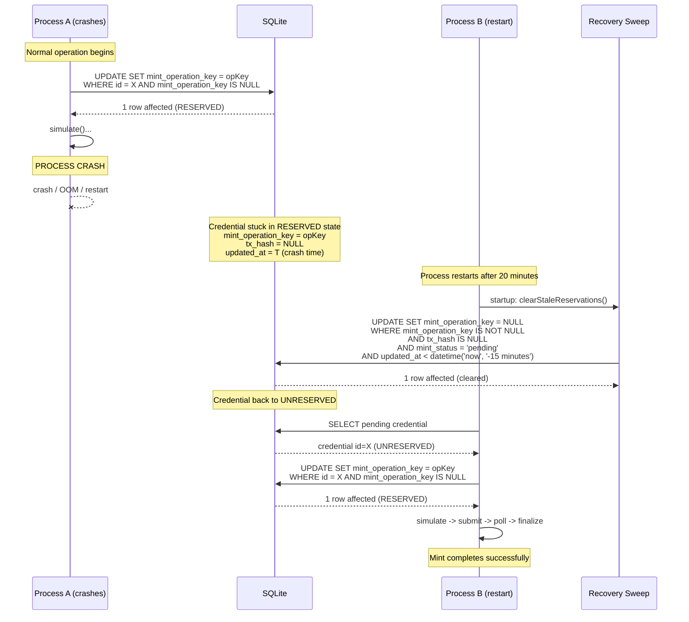
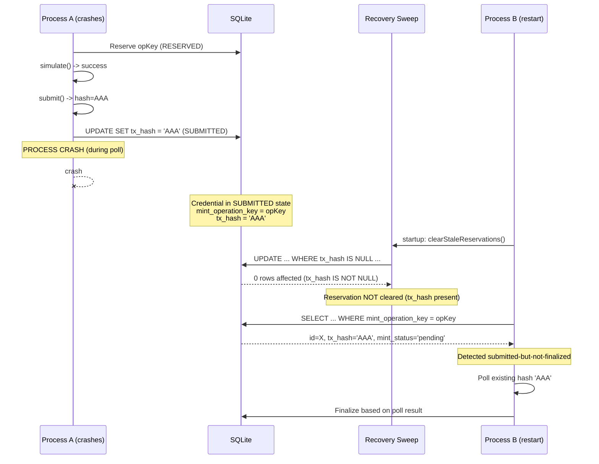
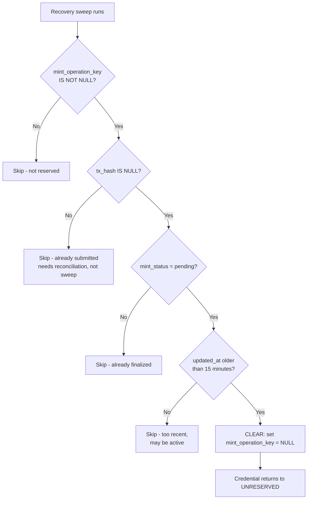

# Crash/Restart Recovery Diagram

- **Date:** 2026-08-20
- **Related:** `2026-08-20-reservation-expiry-recovery-spec.md`

## Scenario: Process Crashes After Reserve, Before Submit

## Scenario: Process Crashes AFTER Submit (tx_hash present)

## Recovery Sweep Decision Tree

