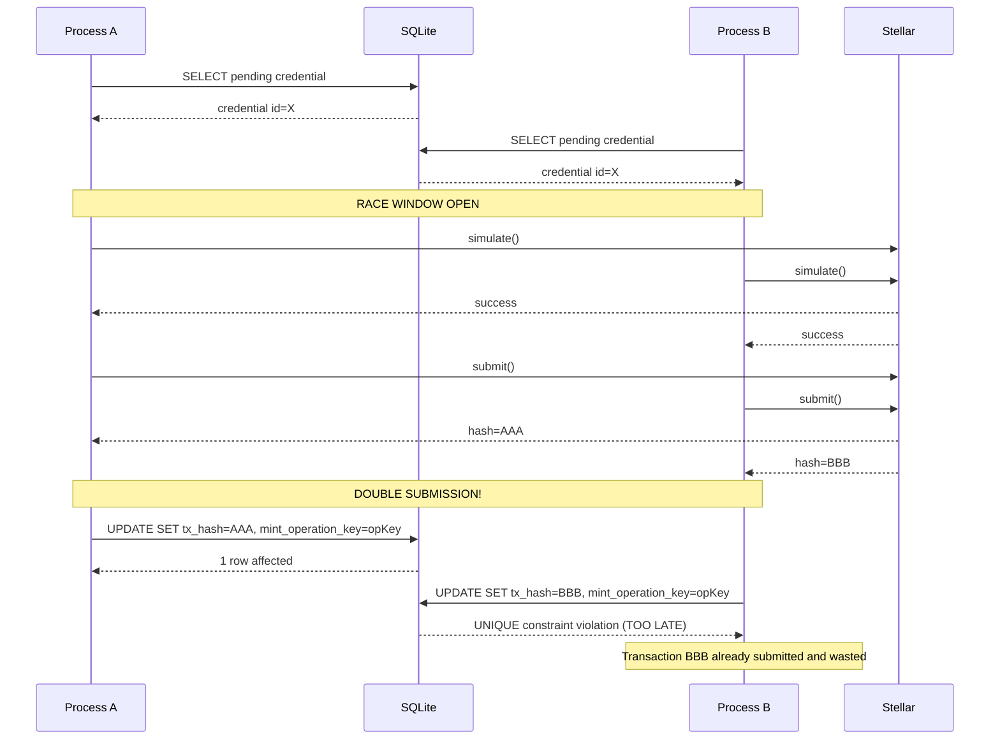
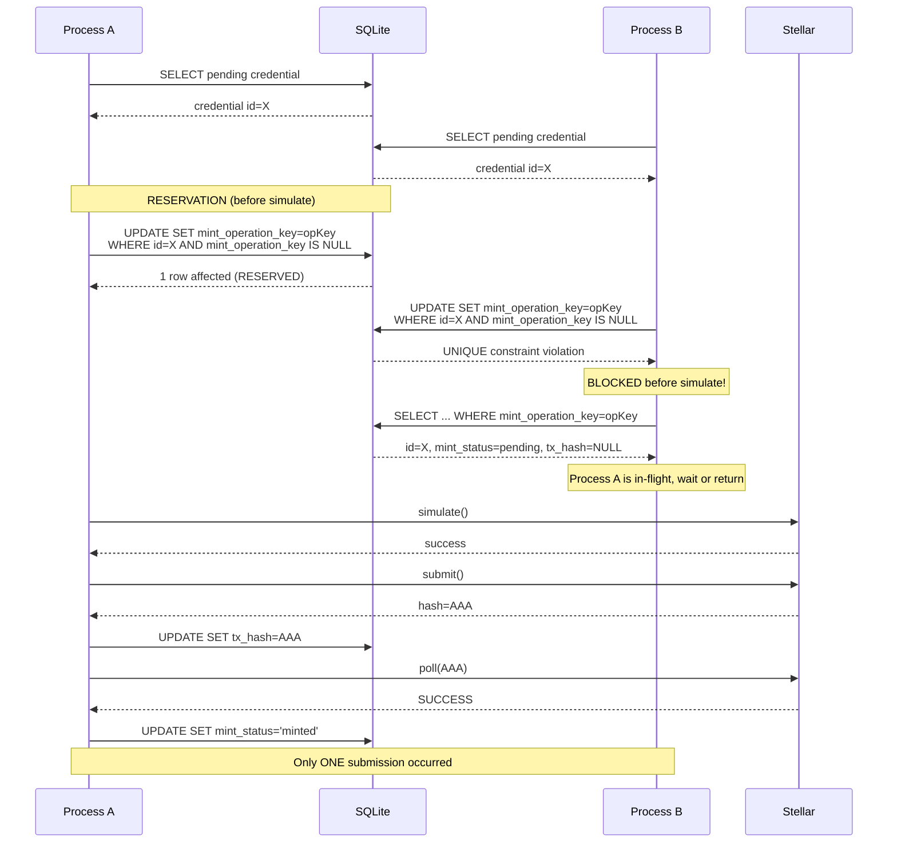

# Cross-Process Race Diagram

- **Date:** 2026-08-20
- **Related:** `2026-08-20-cross-process-idempotency-spec.md`

## Race: Two Processes Attempt Same Mint

### Before Hardening (VULNERABLE)

### After Hardening (SAFE)

## Key Difference

- **Before:** Both processes reach `submit()`. The UNIQUE constraint fires on the second `UPDATE` but the transaction is already on-chain.
- **After:** The UNIQUE constraint fires on the second `UPDATE SET mint_operation_key` BEFORE either process simulates. Only one process proceeds to simulation and submission.
