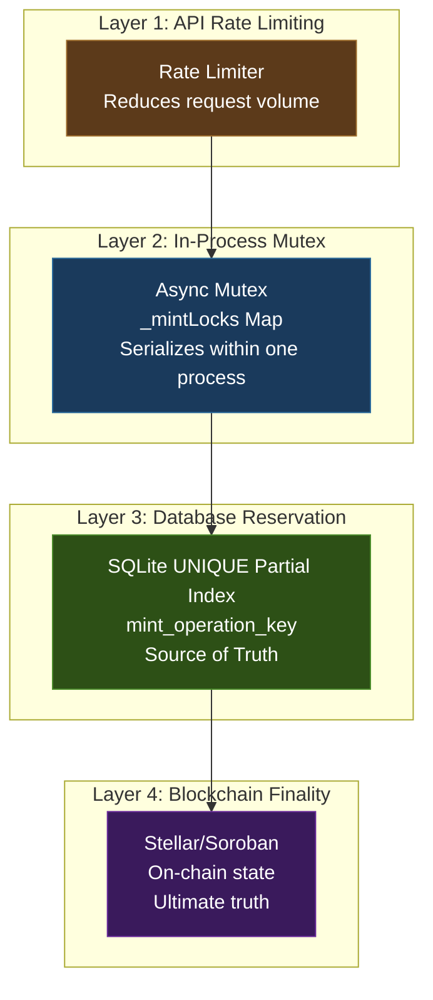
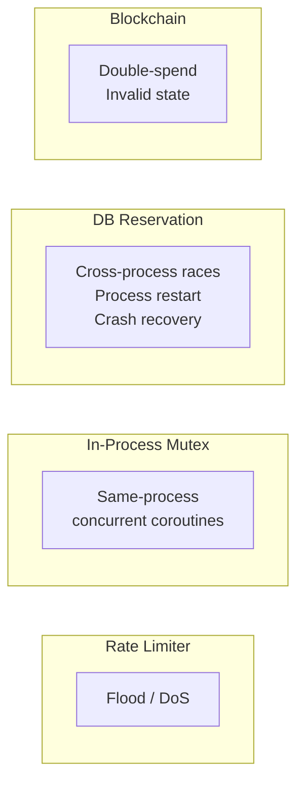
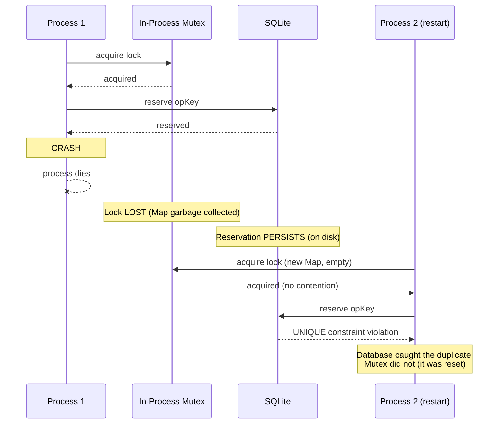

# Database as Source of Truth Diagram

- **Date:** 2026-08-20
- **Related:** `2026-08-20-pre-submit-reservation-spec.md`

## Layered Protection Model

A process-local mutex is an optimization, not the source of truth. The database reservation is the source of truth.

## What Each Layer Protects Against

## Failure Modes by Layer

| Layer | Failure Mode | Impact | Recovery |
|-------|-------------|--------|----------|
| Rate Limiter | Bypassed (direct API call) | More requests reach mutex | Mutex + DB still protect |
| In-Process Mutex | Process crash (Map lost) | Lock lost, no cleanup | DB reservation persists |
| DB Reservation | SQLite corruption | UNIQUE index lost | Restore from backup |
| Blockchain | Network partition | Tx status unknown | Reconciliation via Horizon |

## Why the Database, Not the Mutex, Is Source of Truth

This diagram shows why the in-process mutex cannot be the source of truth: it does not survive process restarts. The database reservation persists on disk and catches duplicates even after the mutex is lost.
