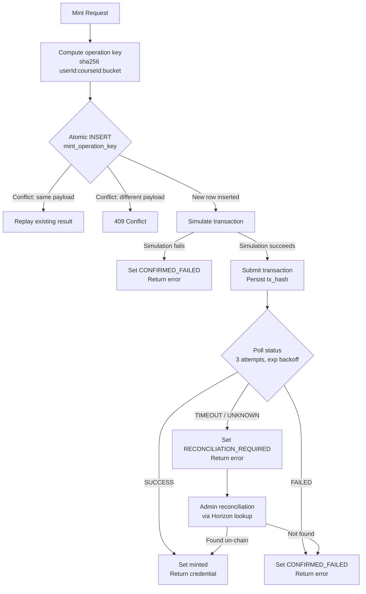

# Durable Idempotency Flow

**Date:** 2026-08-20
**Status:** BLOCKED (requires migration for mint_operation_key column)

## Notes

- The atomic INSERT step requires the `mint_operation_key` column (migration blocked).
- Current interim approach uses in-process Map lock instead of atomic INSERT.
- The flow from "Submit transaction" onward is implemented and tested.

Migration files may be prepared, but execution requires separate approval.
