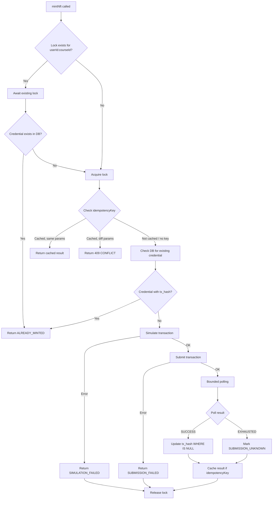
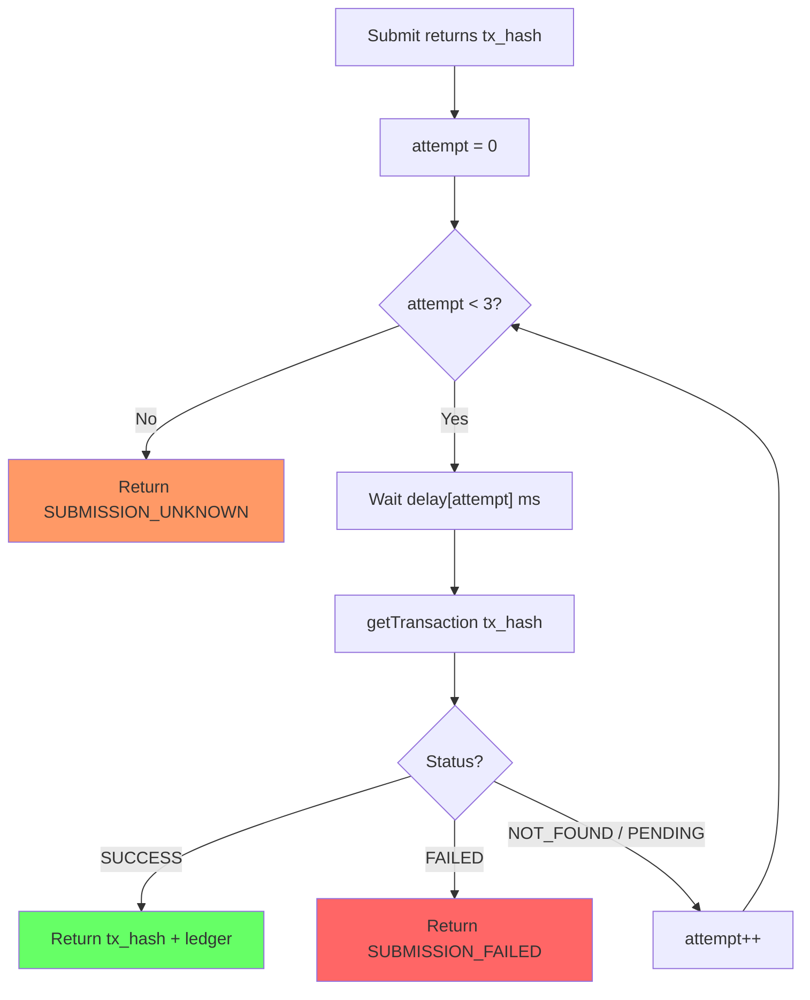
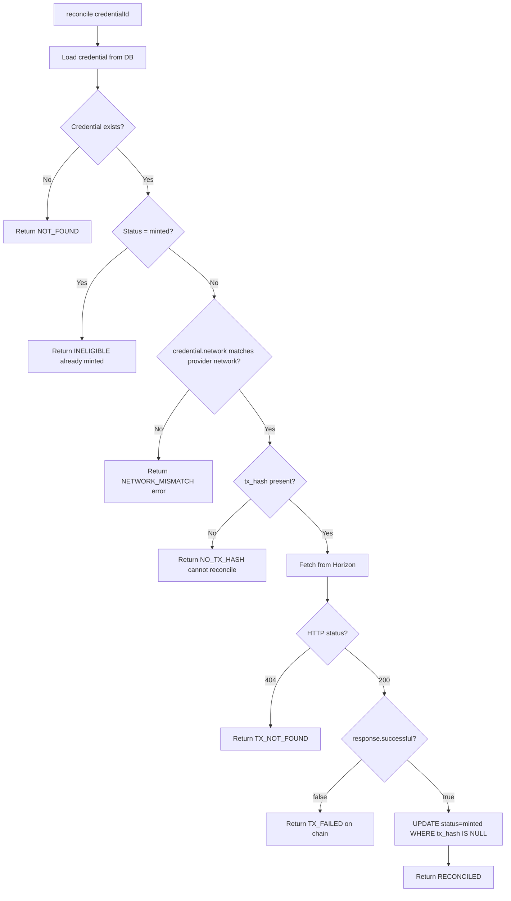
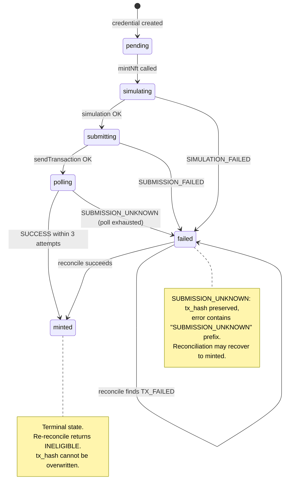

# Enhanced Stellar Provider — Review Diagrams

- **Date:** 2026-08-20
- **Spec:** `docs/superpowers/specs/2026-08-20-enhanced-provider-review-spec.md`

---

## 1. Mint Flow with Concurrency Guard

## 2. Bounded Polling Flow

**Delay schedule:**

| Attempt | Production | Test |
|---------|-----------|------|
| 0 | 1000 ms | 10 ms |
| 1 | 2000 ms | 20 ms |
| 2 | 4000 ms | 40 ms |

## 3. Reconciliation with Network Validation

## 4. State Transitions

