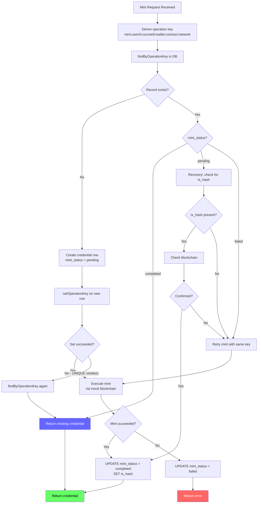

# Idempotency Loop

```mermaid
flowchart TD
    START[Mint Request Received] --> DERIVE[Derive operation key<br/>mint:userId:courseId:wallet:contract:network]
    DERIVE --> LOOKUP[findByOperationKey in DB]
    LOOKUP --> EXISTS{Record exists?}

    EXISTS -->|No| CREATE[Create credential row<br/>mint_status = pending]
    CREATE --> CLAIM[setOperationKey on new row]
    CLAIM --> CLAIM_OK{Set succeeded?}
    CLAIM_OK -->|Yes| MINT[Execute mint<br/>via mock blockchain]
    CLAIM_OK -->|No - UNIQUE violation| REFETCH[findByOperationKey again]
    REFETCH --> RETURN_EXISTING[Return existing credential]

    EXISTS -->|Yes| CHECK_STATUS{mint_status?}
    CHECK_STATUS -->|completed| RETURN_EXISTING
    CHECK_STATUS -->|pending| RECOVER[Recovery: check for tx_hash]
    CHECK_STATUS -->|failed| RETRY[Retry mint with same key]

    MINT --> MINT_OK{Mint succeeded?}
    MINT_OK -->|Yes| COMPLETE[UPDATE mint_status = completed<br/>SET tx_hash]
    MINT_OK -->|No| FAIL[UPDATE mint_status = failed]

    RECOVER --> HAS_TX{tx_hash present?}
    HAS_TX -->|Yes| CHECK_CHAIN[Check blockchain]
    HAS_TX -->|No| RETRY

    RETRY --> MINT
    CHECK_CHAIN --> CHAIN_OK{Confirmed?}
    CHAIN_OK -->|Yes| COMPLETE
    CHAIN_OK -->|No| RETRY

    COMPLETE --> DONE[Return credential]
    FAIL --> DONE_FAIL[Return error]
    RETURN_EXISTING --> DONE

    style DONE fill:#6f6,color:#000
    style DONE_FAIL fill:#f66,color:#fff
    style RETURN_EXISTING fill:#66f,color:#fff
```
