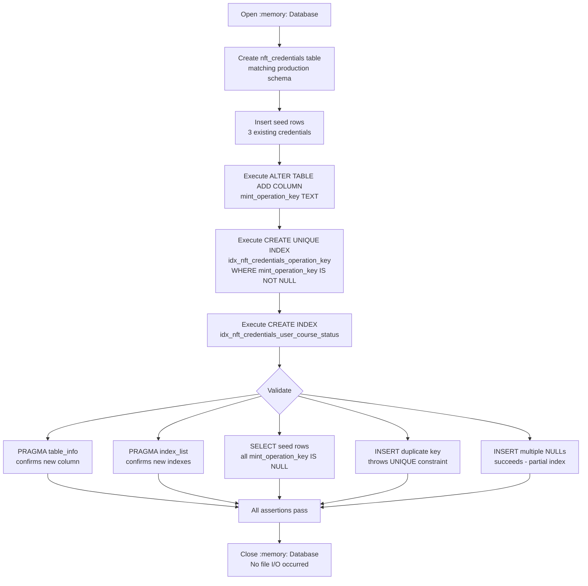

# In-Memory Migration Flow

```mermaid
flowchart TD
    A[Open :memory: Database] --> B[Create nft_credentials table<br/>matching production schema]
    B --> C[Insert seed rows<br/>3 existing credentials]
    C --> D[Execute ALTER TABLE ADD COLUMN<br/>mint_operation_key TEXT]
    D --> E[Execute CREATE UNIQUE INDEX<br/>idx_nft_credentials_operation_key<br/>WHERE mint_operation_key IS NOT NULL]
    E --> F[Execute CREATE INDEX<br/>idx_nft_credentials_user_course_status]
    F --> G{Validate}
    G --> H[PRAGMA table_info<br/>confirms new column]
    G --> I[PRAGMA index_list<br/>confirms new indexes]
    G --> J[SELECT seed rows<br/>all mint_operation_key IS NULL]
    G --> K[INSERT duplicate key<br/>throws UNIQUE constraint]
    G --> L[INSERT multiple NULLs<br/>succeeds - partial index]
    H --> M[All assertions pass]
    I --> M
    J --> M
    K --> M
    L --> M
    M --> N[Close :memory: Database<br/>No file I/O occurred]
```
