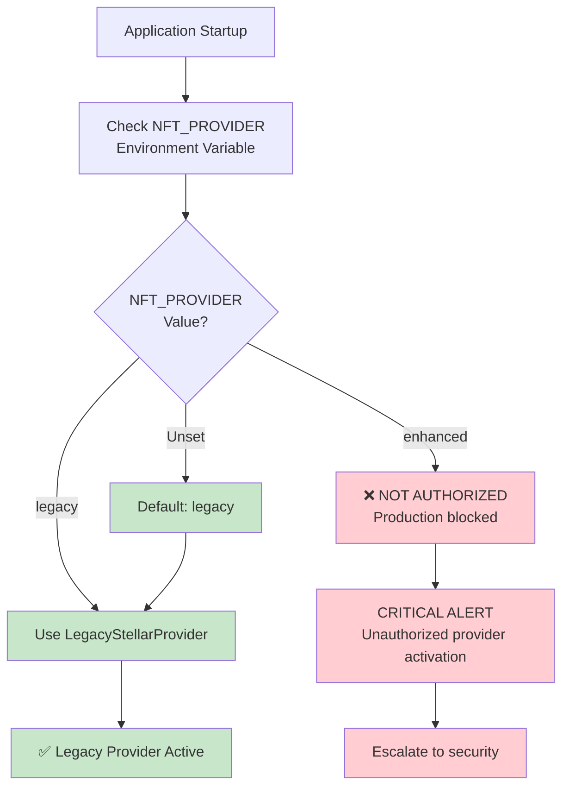
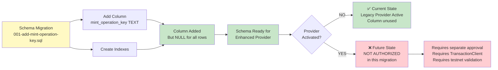
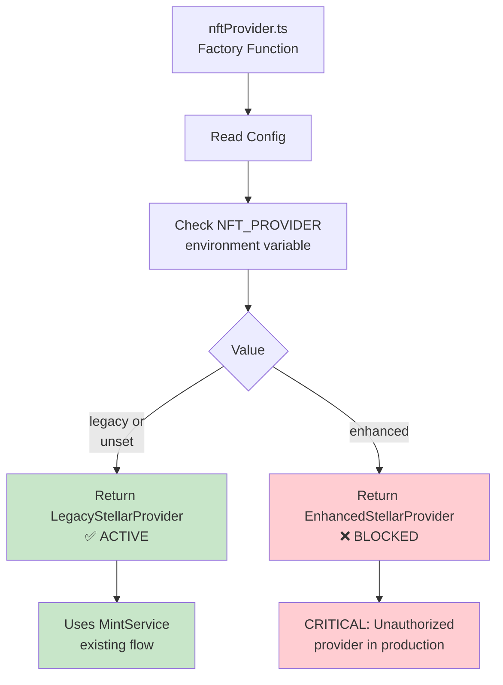
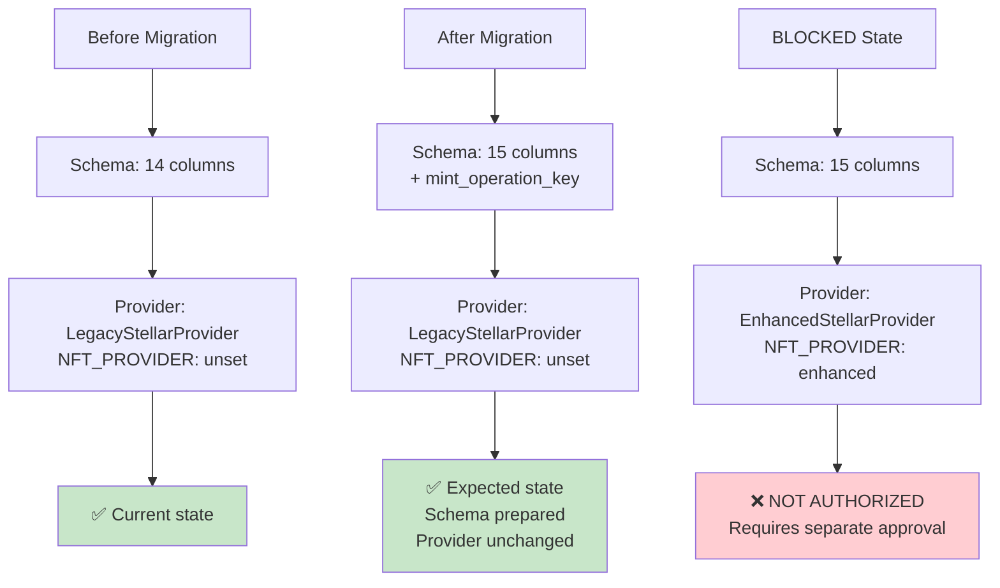
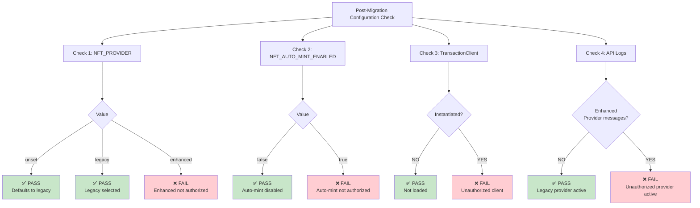
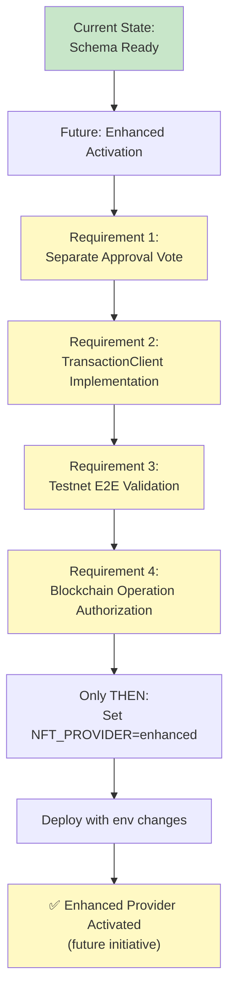
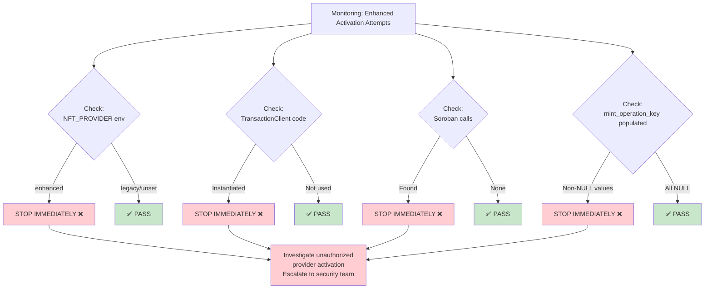

# Legacy Provider Boundary Diagram
**Date:** 2026-08-20
**Document:** Architecture diagram showing provider selection and boundaries

---

## Provider Selection & Boundaries

---

## Schema vs. Provider Lifecycle

---

## Provider Factory & Configuration

---

## Migration Impact on Provider

---

## Configuration Verification Matrix

---

## Enhanced Provider Activation Requirements (FUTURE)

---

## STOP Conditions: Enhanced Activation Boundary

---

## References

- Enhanced Boundary Spec: `2026-08-20-enhanced-provider-activation-boundary-spec.md`
- Migration Plan: `2026-08-20-production-migration-plan.md`
