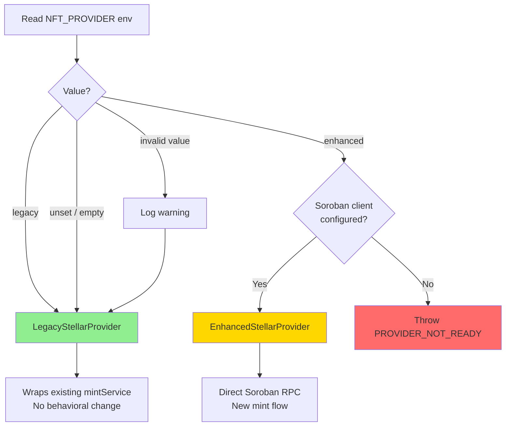

# Legacy Provider Rollback Flow

**Date:** 2026-08-20
**Status:** VERIFIED (5 rollback tests pass)

## Rollback Steps

1. Set `NFT_PROVIDER=legacy` (or unset it entirely).
2. Restart the application (`docker compose up -d --no-deps api`).
3. Verify via health check or `/admin/integration-status` that legacy provider is active.

## Test Coverage

| Test | Env Value | Expected Provider | Result |
|------|-----------|-------------------|--------|
| EP-B5 | `legacy` | LegacyStellarProvider | PASS |
| EP-B6 | _(unset)_ | LegacyStellarProvider | PASS |
| EP-B7 | `invalid` | LegacyStellarProvider | PASS |
| EP-B8 | `enhanced` (no client) | PROVIDER_NOT_READY error | PASS |
| EP-B9 | _(unset)_ | Legacy unaffected by enhanced code | PASS |

No migration is needed for rollback. Enhanced code is inert when inactive.
